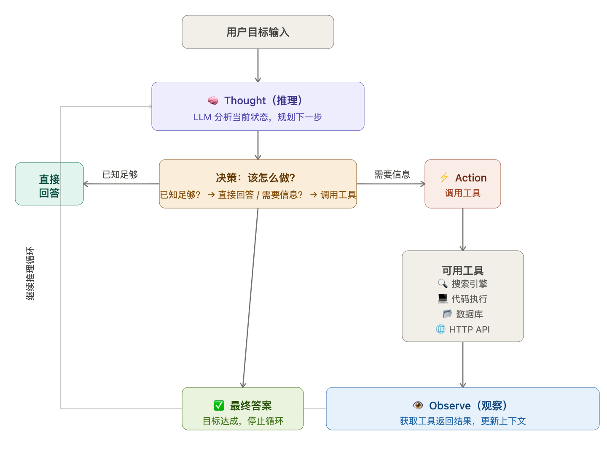

# AGT

# 概念

**Agent（智能体）** 是一种能够**主动感知环境、制定计划、调用工具、执行多步骤任务**的 AI 系统，而不仅仅是回答问题。


# 与传统对话大模型的核心区别

| 维度         | 传统对话大模型          | Agent                               |
| ------------ | ----------------------- | ----------------------------------- |
| **交互模式** | 一问一答，单轮/多轮对话 | 自主规划，多步骤执行                |
| **工具调用** | 无（只输出文本）        | 可调用搜索、数据库、API、代码执行等 |
| **记忆**     | 仅限上下文窗口          | 可有外部长期记忆（向量库等）        |
| **自主性**   | 被动响应                | 主动决策、循环执行                  |
| **目标**     | 完成单次响应            | 完成一个复杂目标                    |

用Java来举例子的话

```java
传统大模型  ≈  一个 static 方法
               String answer = model.chat(input);  // 输入→输出，结束

Agent       ≈  一个运行中的线程/服务
               while (!goalAchieved) {
                   Thought thought = model.think(context);   // 推理
                   Action action   = model.plan(thought);    // 规划
                   Result result   = toolbox.execute(action); // 执行工具
                   context.update(result);                   // 更新状态
               }
```


# Agent 的四个核心组件

```
┌─────────────────────────────────────────┐
│                  Agent                  │
│                                         │
│  🧠 Brain (LLM)  ──→  推理 & 决策       │
│         ↓                               │
│  📋 Planning     ──→  任务分解 & 规划    │
│         ↓                               │
│  🛠️ Tool Use     ──→  搜索/代码/API调用 │
│         ↓                               │
│  💾 Memory       ──→  短期+长期记忆      │
└─────────────────────────────────────────┘
```


# Agent 是怎么决定下一步做什么的？

 

核心机制拆解

#### 第一步：Thought（推理）

LLM 基于当前上下文做推理，本质是**在 Prompt 中写"内心独白"**：

```
当前问题：小米 SU7 最新价格是多少？
当前已知：无
Thought：我没有实时数据，需要搜索。
```

#### 第二步：决策——调工具 or 直接答？

这里有两个关键判断：

| 判断条件           | 决策                      |
| ------------------ | ------------------------- |
| 上下文已有足够信息 | 直接生成答案，结束循环    |
| 需要外部数据       | 选择合适工具，执行 Action |
| 目标太复杂         | 拆解子任务，多轮循环      |

#### 第三步：Action（行动）

LLM 输出结构化的工具调用指令（JSON），程序解析后**真正执行**：

```json
{
  "tool": "search_web",
  "parameters": { "query": "小米SU7 2025年价格" }
}
```

> 关键点：**LLM 本身不执行工具**，它只是"决定调哪个工具、传什么参数"，实际执行由外部程序完成。

#### 第四步：Observe（观察）

把工具返回的结果**注入上下文**，继续下一轮 Thought：

```
Observe: 搜索结果显示 SU7 起售价 21.59 万元（2025年）
Thought: 已获取信息，可以直接回答用户了
Answer: 小米 SU7 2025 年起售价为 21.59 万元
```

------

### 一句话总结

> Agent 的每一步决策，本质是 **LLM 在 Prompt 中做"推理 → 选工具 → 看结果 → 再推理"的循环**，直到它判断"目标已达成"为止。


# 如何防止死循环

```
Prompt 层    →  告诉 LLM 何时该停（治本）
              ↓
逻辑层       →  工具去重 + 失败熔断（治标）
              ↓
框架层       →  maxIterations 硬上限（兜底）
              ↓
系统层       →  全局超时 + 任务取消（最后防线）
```


# 工具如何调用


## 第一层：工具描述怎么告诉 LLM？

就是在 System Prompt 里用 JSON Schema 描述工具，LLM 在训练时已经学会识别这种格式：

json

```json
// 发给 LLM 的 System Prompt 里包含：
{
  "tools": [
    {
      "name": "search_web",
      "description": "搜索互联网获取实时信息",
      "parameters": {
        "type": "object",
        "properties": {
          "query": { "type": "string", "description": "搜索关键词" }
        },
        "required": ["query"]
      }
    }
  ]
}
```

LLM 看到这段描述，就"知道"自己有这个工具可用。

------

## 第二层：LLM 输出什么？

LLM 不输出普通文字，而是输出一段结构化 JSON，由宿主程序识别并拦截：

json

```json
// LLM 的原始输出（不是给用户看的）：
{
  "type": "tool_use",
  "name": "search_web",
  "id": "call_abc123",
  "input": {
    "query": "小米 SU7 2025 价格"
  }
}
```

LLM 之所以能输出这种格式，是因为**微调时专门训练过**——见到工具描述 + 合适的用户问题，就输出 JSON 而不是自然语言。

------

## 第三层：宿主程序做了什么？（Java 视角）

java

```java
// 伪代码展示 LangChain4j 内部逻辑
public String runAgent(String userInput) {
    while (true) {
        // 1. 带着工具描述请求 LLM
        LlmResponse response = llm.chat(buildMessages(history, tools));

        // 2. 判断 LLM 输出的是工具调用还是最终答案
        if (response.isToolCall()) {
            ToolCall call = response.getToolCall();

            // 3. 反射找到对应方法并执行（这才是真正的执行）
            Object result = toolRegistry.invoke(
                call.getName(),      // "search_web"
                call.getArguments()  // {"query": "小米SU7价格"}
            );

            // 4. 把结果塞回 messages，下一轮继续
            history.add(new ToolResultMessage(call.getId(), result.toString()));

        } else {
            // 5. 是最终答案，直接返回
            return response.getText();
        }
    }
}
```

------

## 第四层：完整 messages 长什么样？

每一轮 LLM 看到的是完整的对话历史，包括工具调用和结果：

```
messages: [
  { role: "system",    content: "你是助手，可用工具：[search_web定义...]" },
  { role: "user",      content: "小米SU7最新价格是多少？" },
  { role: "assistant", content: null,
    tool_calls: [{ name: "search_web", input: { query: "小米SU7 2025价格" } }] },
  { role: "tool",      content: "搜索结果：SU7起售价21.59万元..." },
  { role: "assistant", content: "小米SU7 2025年起售价为21.59万元" }  ← 最终答案
]
```

------

## 一句话总结

> Tool Calling = **Prompt 里描述工具 → LLM 输出 JSON → 宿主程序执行 → 结果塞回 Prompt → LLM 继续推理**。LLM 本身从头到尾只做一件事：**预测下一个 token**，"调用工具"这个动作永远由外部程序完成。

这也是面试时要点明的关键：**LLM 不执行工具，它只是输出"我想调这个工具"的 JSON**。


# RAG

## 概念

RAG，本质上是“给大模型挂载一个可检索的记忆库”。

可以理解为：GPT + 企业知识库

它全称叫：
 Retrieval-Augmented Generation

拆开看：

- Retrieval：检索
- Augmented：增强
- Generation：生成


## 为什么需要

因为纯 LLM（大语言模型）有几个天然问题。

1. 知识存在模型参数里，**知识会过期**
2. 上下文窗口有限，不能把所有信息丢进上下文
3. 企业私有知识无法训练进去
4. **幻觉**：LLM有个特点：即使不知道，也会努力回答。

- 编不存在的 API
- 杜撰字段
- 虚构配置项
- 乱引用事实


## 核心流程

**文档切分（Chunk）**

**向量化（Embedding）**

**向量检索（Retrieval）**

**拼 Prompt 给 LLM**


