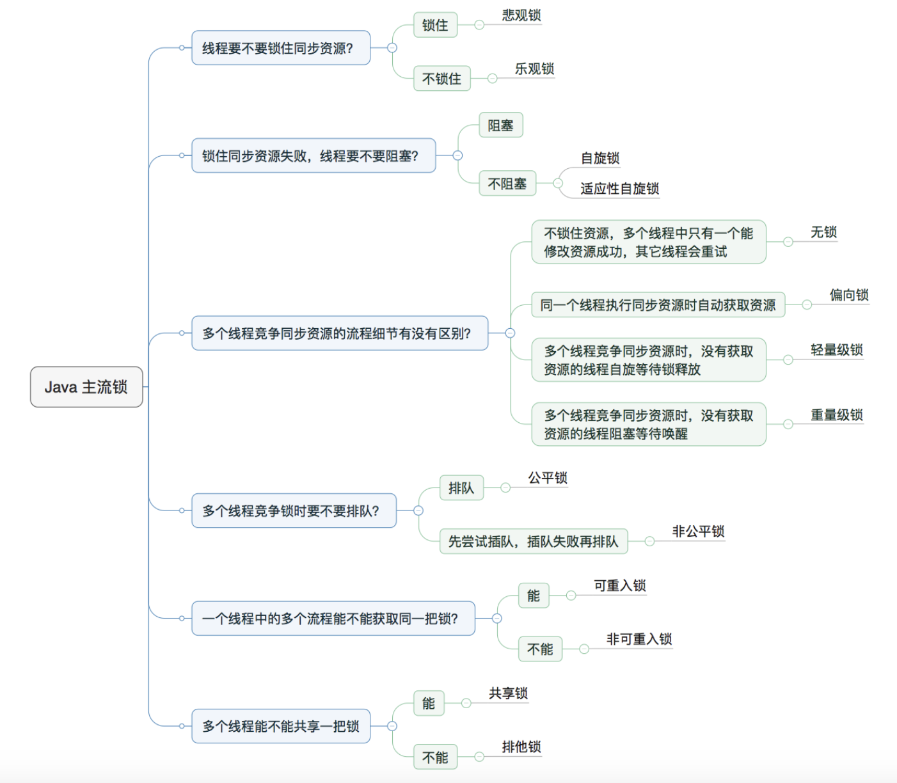
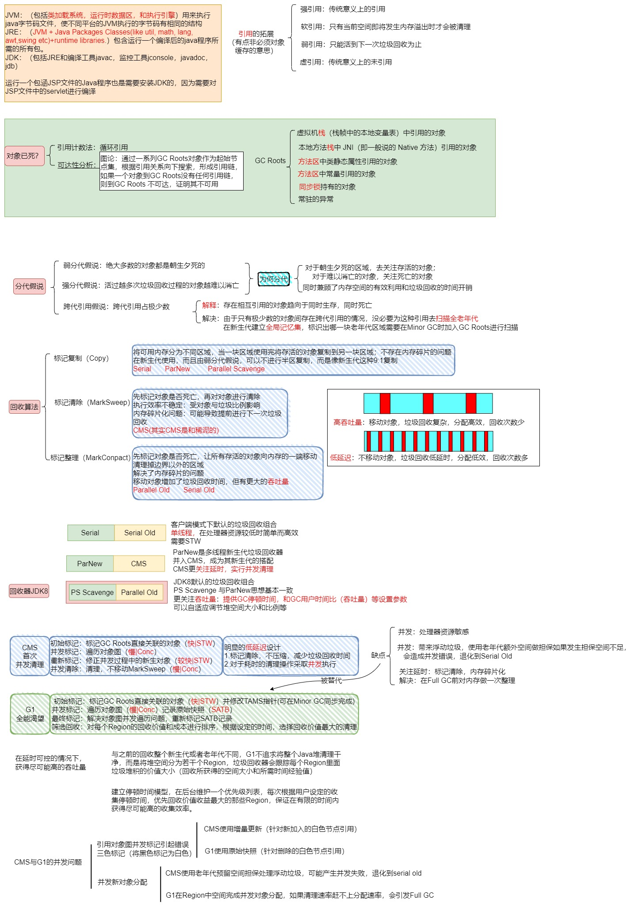

### java基础

#### JDK


#### 数据类型


#### 权限修饰符


#### static


#### 多态


### AQS & ReentrantLock（done）

#### 定义

AQS是java实现的抽象队列同步器，是一个同步机制脚手架，ReentrantLock CountDownLach Semaphore CyclicBarrier都是基于该脚手架实现的同步组件


#### 原理

AQS可以看作是一个共享资源的等待系统：

- State 维护当前共享资源的状态
- 使用CAS尝试获取共享资源
- 获取失败则进入等待队列等待被唤醒unpark


#### AQS概念

 

#### ReentrantLock


#### 闭锁等

1. Semaphore (信号量)

**特点：** 控制同时访问特定资源的**线程数量**。

```
// 允许 3 个并发许可
Semaphore semaphore = new Semaphore(3);

for (int i = 0; i < 10; i++) {
    new Thread(() -> {
        try {
            semaphore.acquire(); // 获取许可，没有就阻塞
            System.out.println(Thread.currentThread().getName() + " 开始执行");
            Thread.sleep(2000);  // 模拟网络 IO
        } catch (InterruptedException e) {
            e.printStackTrace();
        } finally {
            System.out.println(Thread.currentThread().getName() + " 释放许可");
            semaphore.release(); // 释放许可，唤醒排队线程
        }
    }).start();
}
```


2. CountDownLatch (倒计时锁)

**特点：** 侧重于**一个线程**等待**其他 N 个线程**完成某件事（不可重用）。

```
// 初始化计数器为 3
CountDownLatch latch = new CountDownLatch(3);

// 模拟 3 个异步任务
for (int i = 0; i < 3; i++) {
    new Thread(() -> {
        try {
            System.out.println("子线程 " + Thread.currentThread().getName() + " 正在查询分库数据...");
            Thread.sleep(1000);
        } finally {
            latch.countDown(); // 任务完成，计数减 1
        }
    }).start();
}

// 主线程阻塞在这里
latch.await(); 
System.out.println("所有数据查询完毕，主线程开始聚合结果并返回。");
```


3. CyclicBarrier (循环屏障)

**特点：** 侧重于**多个线程互相等待**，步调一致地前进（可循环使用）。

```
// 3个线程相互等待，所有人都到齐后执行一个汇总动作
CyclicBarrier barrier = new CyclicBarrier(3, () -> {
    System.out.println("\n--- 阶段任务达成：所有线程已完成当前解析，准备入库 ---\n");
});

Runnable task = () -> {
    for (int i = 1; i <= 2; i++) { // 模拟处理 2 个文件
        try {
            System.out.println(Thread.currentThread().getName() + " 正在解析文件 " + i);
            Thread.sleep((long) (Math.random() * 1000)); // 模拟耗时差异
            
            System.out.println(Thread.currentThread().getName() + " 到达屏障点");
            barrier.await(); // 所有人都在这等着，齐了才放行
            
            System.out.println(Thread.currentThread().getName() + " 开始入库操作 " + i);
        } catch (Exception e) {
            e.printStackTrace();
        }
    }
};

new Thread(task, "Thread-A").start();
new Thread(task, "Thread-B").start();
new Thread(task, "Thread-C").start();
```


### [ThreadLocal](https://mp.weixin.qq.com/s?__biz=MzkxNTE3NjQ3MA==&mid=2247491733&idx=1&sn=2a4efe9f12a6d3009d89d703e7dadaa5&chksm=c1618decf61604fa0eb46bb65e31248db2bd555527dc558b19c5a60a2be634a24e5e1bc79e0c&scene=21#wechat_redirect)（done）

#### 定义

ThreadLocal是java提供的一种**线程隔离**的机制，为每个线程提供一个独立的访问空间，可以安全的读写


#### 组成（原理）

ThreadLocal的数据是存在线程对象（Thread实例）内部的一个ThreadLocalMap里的：

- Key：ThreadLocal对象本身
- Value：当前线程对应的变量

每个线程由自己独立的map，操作无需加锁，性能高


#### 作用（使用场景）

1. 使用资源本地化的方式来避免线程争抢的问题，也避免了锁消耗（比如用户私有的信息，上下文信息）不同的线程在 get 的时候 get 到的是当前线程的值（多个线程（请求）都会使用同一个变量，但是又不共享，可以设置为每个线程独自的变量，线程间互不干扰；）
2. 设置一个线程域的变量，线程内处处可以访问，较少方法的过度封装。


#### set的底层原理

当你调用 `userContext.set("用户A")` 时

1. **获取当前线程：** 它先通过 `Thread.currentThread()` 拿到当前正在运行的线程对象。
2. **拿到 Map：** 获取这个线程对象内部的 `threadLocals` 成员。
3. **存入数据：** 往这个 Map 里存数据，`Key` 是你 `new` 出来的那个 `userContext` 对象，`Value` 是 `"用户A"`。

`ThreadLocal` 本身不装东西，它只是定义了一个**存取规范**。数据是散落在各个线程的私有空间里的。

这种设计非常高级：它利用了 **“谁执行代码，谁就是当前线程”** 这个隐含条件，实现了无锁的状态隔离。这也是为什么它能解决 `SimpleDateFormat` 等非线程安全工具类问题的根本原因。


#### demo

```java
import java.util.concurrent.ExecutorService;
import java.util.concurrent.Executors;

public class ThreadLocalDemo {

    // 1. 定义一个 ThreadLocal 变量，用来存储当前线程的用户信息
    private static final ThreadLocal<String> userContext = new ThreadLocal<>();

    public static void main(String[] args) {
        // 模拟一个固定大小为 2 的线程池（模拟线程复用场景）
        ExecutorService threadPool = Executors.newFixedThreadPool(2);

        for (int i = 1; i <= 3; i++) {
            final int requestId = i;
            threadPool.execute(() -> {
                try {
                    // 2. 模拟从请求头或 Session 中获取用户信息并设置到 ThreadLocal
                    String userInfo = "用户-" + requestId;
                    userContext.set(userInfo);

                    // 3. 模拟业务逻辑调用（不需要传参，直接从 ThreadLocal 拿）
                    doBusinessLogics();

                } finally {
                    // 4. 重要！使用完后务必移除，防止内存泄漏和线程复用导致的数据污染
                    userContext.remove();
                    System.out.println(Thread.currentThread().getName() + " [已清理]");
                }
            });
        }
        threadPool.shutdown();
    }

    private static void doBusinessLogics() {
        // 直接 get() 即可获取当前线程绑定的数据
        String user = userContext.get();
        System.out.println(Thread.currentThread().getName() + " [Service层] 正在为 " + user + " 处理跨境物流订单...");
    }
}
```


#### 为什么一般为static

一个成员变量是否为 static 修饰决定了它是实例变量还是静态变量，ThreadLocal 的语义和作用是使这个变量成为 per-thread 而不是 per-instance 的。


#### 实现

```java
public class Thread implements Runnable {
    // 每个线程内部有一个ThreadLocalMap 类型的 threadLocals 用来存储本地变量
    ThreadLocal.ThreadLocalMap threadLocals = null;
}
```

 

在 Thread 中维护一个 ThreadLocalMap 变量，以ThreadLocal 作为 key，以对应的值作为 value 

如何找到：

通过 ThreadLocal 变量的 get 方法，Thread  ---->   ThreadLocalMap   ---->   getEntry(this)   ---->   return entry.value

 


#### 哈希冲突

ThreadLocalMap 解决哈希冲突的方式是开放地址法（线性探测），如果当前索引发生哈希冲突，则线性的寻找下一个位置

 

这样做肯定没有 HashMap 的拉链法效率高，但是ThreadLocalMap 存的数目有限，再把加载因子降低一些(2/3)，冲突的可能性就降低了，方式简单而且避免使用指针。


#### 弱引用与内存泄漏

 

ThreadLocal 变量是作用在一个线程里的，当一个线程销毁，这些变量自然的被回收掉，但是一**般使用线程池的时候，线程是常驻的**，这种情况下如果不做一些附加操作的话，工作线程的 ThreadLocalMap 中的数据可能会保留很多无用的数据，由于和线程之间有引用链，因此可能永远不会被垃圾回收掉。

因此 ThreadLocalMap 中的 Entry 继承了 WeakReference<ThreadLocal<?>> 弱引用，在实例化的时候使用 super(key) 将 key 对threadLocal 变量的引用设为弱引用，当不存在其它强引用的时候，该 key 锁对应的 ThreadLocal 对象将被回收，在 ThreadLocalMap 后续的 set() 操作或者是扩容的过程中遇到 key 为空的 Entry 会进行清理，但是 ThreadLocal 的数据较少，清理的概率较低，仍然有较大的可能发生内存泄漏，**所以最规范的操作就是在执行完相应的功能后进行手动的 remove() 。**

**为什么不把 value 设为弱引用**，我觉有两个方面的原因，第一，Map 结构是通过 key 查询 value 的，也就是说，**外界引用一般作用在 key 上**，所以通过 key 的引用更具有”Entry无用“的代表性；第二点，如果将 value 设为弱引用，可能会 get() 到空值，**引发空指针异常**。

**为什么不用软引用？**我个人理解是根据 ThreadLocal 的语义，当一个请求或者，一个任务结束，ThreadLocalMap 中的 key 不再存在任何强的引用，这个时候就应该立马将其判定为可回收的状态，在下次垃圾回收时，直接将其回收掉。SoftReference 更没有那么强烈的清理欲望，而是等到内存即将溢出时才回收，这种非即时性会导致原本就**依靠概率**的减少内存泄漏的问题更加严重

#### InheritableThreadLocal

这玩意可以理解为就是可以把父线程的 threadlocal 传递给子线程，所以如果要这样传递就用 InheritableThreadLocal ，不要用 threadlocal。


### 线程池（done）


#### 为什么要使用线程池

1. 创建/销毁线程需要消耗系统资源，线程池可以**复用已创建的线程**。
2. **控制并发的数量**。可以通过核心线程数和最大线程数控制任务的最大并发数量
3. **可以对线程做统一管理**。


#### 线程池组成

工作线程：为了避免线程的频繁创建和销毁，线程池“缓存”了一些工作线程，这些线程在线程池中循环工作流来保持存活。

任务阻塞队列：（**生产者消费者模式**）线程池将任务入队（offer），工作线程从队列中取任务执行（**如何复用，保持存活，超时销毁**）

**原子类 ctl：记录线程池的状态和线程数（高3 state，低29 线程数）**

 


#### 阻塞队列的作用

1. 解耦和缓冲：吸收突发的流量，避免频繁创建和销毁线程
2. 保持核心线程数存活（take()阻塞）
3. 控制非核心线程销毁（poll(time)超时销毁）


#### 线程如何被回收

> 超过 corePoolSize 的空闲线程由线程池回收，线程池 Worker启动跑第一个任务之后就一直循环遍历线程池任务队列，超过指定超时时间获取不到任务就 remove Worker，最后由垃圾回收器回收。


#### 线程池参数

- **int corePoolSize**：**核心线程数最大值**

  > 核心线程：默认一直运行，即使没有任务也不销毁
  >
  > 非核心线程：在 poll() 时，如果超过指定阻塞时间就会被销毁

- **int maximumPoolSize**：该线程池中**线程总数最大值** 。

  > 该值等于核心线程数量 + 非核心线程数量。

- **long keepAliveTime**：**非核心线程闲置超时时长**。

  > 非核心线程如果处于闲置状态超过该值，就会被销毁。如果设置**allowCoreThreadTimeOut(true)，则会也作用于核心线程**。

- **TimeUnit unit**：keepAliveTime的单位。

- **BlockingQueue workQueue**：阻塞队列，维护着**等待执行的Runnable任务对象**。

  常用的几个阻塞队列：

  1. **LinkedBlockingQueue**

     链式阻塞队列，底层数据结构是链表，默认大小是`Integer.MAX_VALUE`，也**可以指定大小**。

  2. **ArrayBlockingQueue**

     数组阻塞队列，底层数据结构，是数组，需要指定队列的大小。

  3. **SynchronousQueue**

     同步队列，内部容量为0，每个put操作必须**等待**一个take操作，反之亦然。

  4. **DelayQueue**

     延迟队列，该队列中的元素只有当其指定的延迟时间到了，才能够从队列中获取到该元素 

- **ThreadFactory threadFactory**

  创建线程的工厂 ，用于批量创建线程，统一在创建线程时设置一些参数，如是否守护线程、线程的优先级等。如果不指定，会新建一个默认的线程工厂。

```java
static class DefaultThreadFactory implements ThreadFactory {
    // 省略属性
    // 构造函数
    DefaultThreadFactory() {
        SecurityManager s = System.getSecurityManager();
        group = (s != null) ? s.getThreadGroup() :
        Thread.currentThread().getThreadGroup();
        namePrefix = "pool-" +
            poolNumber.getAndIncrement() +
            "-thread-";
    }

    // 省略
}
```

- **RejectedExecutionHandler handler**

  **拒绝处理策略**，线程数量大于最大线程数就会采用拒绝处理策略（或者执行了shutdown后的线程池），四种拒绝处理的策略为 ：

  1. **ThreadPoolExecutor.AbortPolicy**：**默认拒绝处理策略**，丢弃任务并抛出RejectedExecutionException异常。
  2. **ThreadPoolExecutor.DiscardPolicy**：丢弃新来的任务，但是不抛出异常。
  3. **ThreadPoolExecutor.DiscardOldestPolicy**：丢弃队列头部（最旧的）的任务，然后重新尝试执行程序（如果再次失败，重复此过程）。
  4. **ThreadPoolExecutor.CallerRunsPolicy**：由调用线程处理该任务。


#### 线程池状态

 

- 线程池创建后处于**RUNNING**状态。
- 调用**shutdown()**方法后处于**SHUTDOWN**状态，线程池不能接受新的任务，并清除一些空闲worker，等待阻塞队列的任务完成。
- 调用shutdownNow()方法后处于**STOP**状态，线程池不能接受新的任务，中断所有线程，阻塞队列中没有被执行的任务全部丢弃。此时，poolsize=0,阻塞队列的size也为0。
- 当所有的任务已终止，ctl记录的”任务数量”为0，线程池会变为**TIDYING**状态。接着会执行terminated()函数。


#### [如何优雅的关闭线程池](https://segmentfault.com/a/1190000038258152)

> 大量的线程常驻在后台对系统资源的占用是巨大的 ，甚至引发异常
>
> 在 `Java` 中和关闭线程池相关的方法主要有如下：
>
> - void shutdown()
> - List<Runnable> shutDownNow()
> - boolean awaitTermination()
> - boolean isShutDown()
> - boolean isTerminated()


##### ShutDown（够用了）

所有线程会正常执行结束后再关闭线程池，对于 ShutDown() 而言它可以**安全的停止一个线程池**，它有几个关键点

- `ShutDown` 会首先将线程设置成 SHUTDOWN 状态，然后中断所有没有正在运行的线程
- 正在执行的线程和已经在队列中的线程并不会被中断，说白了就是使用 shutDown() 方法其实就是要等待所有任务正常全部结束以后才会关闭线程池
- 调用 shutdown() 方法后如果还有新的任务被提交，线程池则会根据**拒绝策略直接拒绝后续新提交**的任务。

###### ShutDownNow

- 当执行`shutDownNow` 方法后，会向全部正在运行的队列通知中断，**正在运行的线程接收到中断信号后选择处理**，而在队列中的全部取消执行转移到一个`list`队列中返回，如上述 `List<Runnable> runnables` ，这里记录了所有终止的线程

###### awaitTermination

- 这个方法并不是用来关闭线程池的，首先我们看一下这个方法的定义：

> boolean awaitTermination_(_long timeout, TimeUnit unit_)_

- 这个方法的作用是，调用后等待`timeout`时间后，反馈线程池的状态
- 等待期间（包括进入等待状态之前）线程池已关闭并且所有已提交的任务（包括正在执行的和队列中等待的）都执行完毕，相当于线程池已经“终结”了，方法便会返回 `true`；
- 等待超时时间到后，第一种线程池“终结”的情况始终未发生，方法返回 `false`；
- 等待期间线程被中断，方法会抛出 InterruptedException 异常。

###### isShutDown() 

一般用于判断是否可以再提交任务

- `isShutDown` 方法正如名字，判断线程池是否停止，返回的是 `Boolean` 类型，如果已经开始停止线程池则返回 `true` 否则放回false
- 当调用了`shutDown` 或`shutDownNow` 时之后，会返回 `true` 不过需要注意，这时候只是代表线程池关闭流程的开始，并不是说线程池已经停止了

###### isTerminated()

一般用于判断所有任务是否全部已完成

- 这个方法与上面的方法的区别就是这是正真检测线程池是否真的终结了
- 这不仅代表线程池已关闭，同时代表线程池中的所有任务都已经都执行完毕了，因为在调用 `shutdown `方法之后，线程池会继续执行里面未完成的任务，包括正在执行的任务和在任务队列中等待的任务。
- 如果调用了 `shutdown` 方法，但是有一个线程依然在执行任务，那么此时调用 `isShutdown `方法返回的是 `true`，而调用 `isTerminated`方法返回的便是 `false`，因为线程池中还有任务正在在被执行，线程池并没有真正“终结”。
- 直到所有任务都执行完毕了，调用 `isTerminated() `方法才会返回 `true`，这表示线程池已关闭并且线程池内部是空的，所有剩余的任务都执行完毕了。


#### 工作原理简述

> addWork(command, true) ----> offer() ----> addWork(null, false) ----> reject()

 

1. 线程总数量 < corePoolSize，无论线程是否空闲，都会新建一个核心线程执行任务（让核心线程数量快速达到corePoolSize，在核心线程数量 < corePoolSize时）。**注意，这一步需要获得全局锁（因为涉及到线程池状态的变更，需要保证原子性）。**(可以使用preStartAllCoreThreads()预加载所有核心线程)
2. 线程总数量 >= corePoolSize时，新来的线程任务会进入任务队列中等待，然后空闲的核心线程会依次去缓存队列中取任务来执行（体现了**线程复用**）。
3. 当缓存队列满了，需要创建非核心线程去执行这个任务。**注意，这一步需要获得全局锁。**
4. 缓存队列满了， 且总线程数达到了maximumPoolSize，则会采取上面提到的拒绝策略进行处理。


#### [源码解析](https://www.cnblogs.com/tomakemyself/p/14018814.html)

核心方法 execute()

```java
public void execute(Runnable command) {
    if (command == null)
        throw new NullPointerException();   
    int c = ctl.get();
    // 1.当前线程数小于corePoolSize,则调用addWorker创建核心线程执行任务
    if (workerCountOf(c) < corePoolSize) {
       if (addWorker(command, true))
           return;
       c = ctl.get();
    }
    // 2.如果不小于corePoolSize，则将任务添加到workQueue队列。
    if (isRunning(c) && workQueue.offer(command)) {
        int recheck = ctl.get();
        // 2.1 如果isRunning返回false(状态检查)，则remove这个任务，然后执行拒绝策略。
        if (! isRunning(recheck) && remove(command))
            reject(command);
            // 2.2 线程池处于running状态，但是没有线程，则创建线程
        else if (workerCountOf(recheck) == 0)
            addWorker(null, false);
    }
    // 3.如果放入workQueue失败，则创建非核心线程执行任务，
    // 如果这时创建非核心线程失败(当前线程总数不小于maximumPoolSize时)，就会执行拒绝策略。
    else if (!addWorker(command, false))
         reject(command);
}
```


##### [Java线程池是如何保证核心线程不被销毁的](https://blog.csdn.net/smile_from_2015/article/details/105259789)


####  手写线程池

```java
package ThreadPool;

import java.util.ArrayList;
import java.util.List;
import java.util.concurrent.ArrayBlockingQueue;
import java.util.concurrent.BlockingQueue;

/**
 * @author lunfee
 * @create 2022/5/4-14:38
 */
public class LunfeeThreadPool {
    BlockingQueue<Runnable> taskQueue;
    List<WorkThread> threads;
    public LunfeeThreadPool(BlockingQueue<Runnable> taskQueue, int capacity) {
        this.taskQueue = taskQueue;
        this.threads  = new ArrayList<>();
        for(int i = 0; i < capacity; i++) {
            WorkThread workThread = new WorkThread("Work-" + i);
            workThread.start();
            threads.add(workThread);

        }
    }
    void execute(Runnable task) throws InterruptedException {
        taskQueue.put(task);
    }
    class WorkThread extends Thread{
        public WorkThread(String name) {
            super(name);
        }
        @Override
        public void run() {
            while(true) {
                Runnable task = null;
                try {
                    task = taskQueue.take();
                } catch (InterruptedException e) {
                    e.printStackTrace();
                }
                task.run();
            }
        }
    }
    public static void main(String[] args) throws InterruptedException {
        final int NUM = 10;
        LunfeeThreadPool threadPool = new LunfeeThreadPool(new ArrayBlockingQueue<>(9), 5);
        for(int i = 0; i < NUM; i++) {
            threadPool.execute(() -> {
                System.out.println(Thread.currentThread().getName() + " execute a task...");
            });
        }
    }
}

```


#### 使用线程池案例&参数设置

使用多线程的目的：是充分利用多核 CPU 资源，在尽可能减少线程上下文切换的同时，充分利用线程等待的 CPU 空闲时间

线程池大小需要参考的因素：

1. 机器当前 CPU 占用率
2. 当前程序已启动线程数目
3. **当前任务 I/O 执行时间和运算时间占比**

参数设置

> 网上有一个流传的公式：CPU 密集型设置为 CORE_NUM + 1，I/O 密集型 CORE_NUM * 2 + 1，考虑是否 I/O 密集是没错的，但是这样的设置比较绝对，我想一般没有人这么用；一般的后端系统都是伴随着数据处理+网络I/O+数据库I/O，所以重要的是二者的比例，理论上，如果没有 I/O 操作的话，线程数设置为 CORE_NUM 就可以了，这样做使得每个内核同时执行的话都跑满；这时如果 I/O 时间越多，就意味着 CPU 空闲时间越长，就可以开更多的线程提高利用率，所以我觉得如果一定要有一个参考公式的话应该用
>
> Nthreads = Ncores x Ruse x (R(IO / 计算) + 1)

使用经验

> 我做过一个核酸检测结果统计的项目，由于政府提供的接口只能一条一条的查询，即使我们把数据库存储优化到极致，也没办法突破每个查询的200ms 的网络等待，项目最初就是一个一天一次的半夜定时任务，一次执行要3-4个小时，计算时间，也就是内存的操作时间很短，理论上可以开 CORE_NUM 好几倍的线程数，但是考虑到网络超时的问题，最后设置的是 2 * CORE_NUM，时间降低到几分钟，就可以使用一个异步的**观察者模式**手动触发然后统计报表。


#### 核心线程数等于最大线程数

如果涉及到削峰，可以设置更大的最大线程数，否则的话可以相等


#### 为什么不推荐使用Executors创建线程池

阿里巴巴Java开发手册中提到，不要使用 Executors 创建线程池，一方面为了明确线程池的使用规则，另一方面防止资源耗尽。

```java
package executers;

import java.util.concurrent.Executors;

/**
 * @author lunfee
 * @create 2022/5/7-13:17
 */
public class Foo {
    public static void main(String[] args) {
        //同步队列，核心线程数为零，最大线程数为 Integer.MAX_VALUE，可能导致资源耗尽
        Executors.newCachedThreadPool();
        //fixed指的是核心线程数和最大线程数相等，阻塞队列无边界，可以放入无限多任务
        Executors.newFixedThreadPool(10);
        //所有任务由一个线程执行，阻塞队列无边界
        Executors.newSingleThreadExecutor();
        //延时队列，最大线程数 Integer.MAX_VALUE
        Executors.newScheduledThreadPool(10);
    }
}
```


### Thread（done）

#### 死锁

##### 死锁条件

简单说：线程A持有互斥资源1，等待线程B释放资源2，线程B持有资源2，等待线程A释放资源1，形成了一个闭环等待的阻塞链。

1. 互斥条件：资源只能被一个线程占用，（比如Java的互斥锁，Mysql的行级锁）
2. 请求与保持：线程已经持有了一个资源，同时还在请求另外一个资源
3. 不可剥夺：线程已经持有的资源只能由自己释放，不能被剥夺
4. 循环等待：多个线程形成环形的等待链

##### 死锁如何破解？

1. 不可避免
2. 尽量不要有先获得两个锁的动作
3. 补救：**等待资源时可以主动超时释放**，拿不到就释放掉，比如trylock + 超时时间
4. 重点：**按顺序获取资源**，避免循环等待


##### 死锁排查

[（回Mysql）](# MySQL)

**Java层面的话可以：**

1. top 指令看下当前当前可能异常的进程 或者 ps指令查当前进程的PID

   > top指令是实时查看进程的心跳（进程的cpu使用率和内存占用率，系统的负载（正在运行 + 正在等待 CPU 的进程数量））
   >
   > ps指令查所有进程列表

2. jstack指令查看当前进程所有线程的执行快照，看下有没有已知的死锁（deedlock字眼），没有的话，可以重点看下哪些线程是被BLOCK的，代码当前在执行哪一行，有没有循环阻塞，持有那个锁在等待哪个锁

3. 什么时候有理由怀疑？监控发现非网络IO导致的超时失败问题和接口RT尖刺。


**mysql死锁排查：**

mysql有的设计本身就可能会形成死锁，被检测出来mysql会回滚一个事务解除死锁

比如：

a.更新顺序不一致:

```
T1: update A -> update B
T2: update B -> update A
```

b.范围查询 + gap lock

```
select * from user where id > 10 for update;
```

解决方案

> 按固定顺序访问资源（最重要）
> 减小事务粒度（缩短持锁时间）
> 尽量直接命中索引（避免锁扩大）


如何查看
SHOW ENGINE INNODB STATUS


#### 并发与并行

简单来说：并发表示多个任务同时在执行，互不干扰；并发的话一般指的是CPU内核可能会在不同的任务之间切换时间片。

> 从 CPU 调度的角度讲：并发指的是多个线程在同一个 CPU 内核上执行，CPU 为每个线程分配时间片轮流执行；
>
> 并行则是不同的线程在不同的 CPU 内核上同时执行；
>
> 从程序或者接口的角度讲：并发指的是，某一时刻，多个用户同时访问某段程序
>
> 在垃圾回收场景：并发指的是垃圾回收线程和用户线程在同时进行，并行指的是多个线程在同时进行回收工作


#### 为什么创建线程是expensive

每创建一个线程都对应操作系统注册和创建一个本地线程

JVM会为线程创建一个较大的栈空间，并初始化


#### Thread start 方法

1. **直接调用 Runnable 的方法**不可以以开启线程的方式执行，因为 Java 线程和操作系统线程一一对应，必须执行本地方法 start0() 完成线程创建。

2. **不能反复或者在线程结束调用 start 方法**，因为在执行的时候会检查 threadState 是为0(NEW)，否则会抛出非法的线程状态异常。


#### **线程状态与转换**

 

#### 同步与互斥

> 同步是多线程情况下，不同线程之间按照一定的顺序执行。目的是保证运行结果的正确性
>
> 互斥是一个集合的概念，表示一个资源被线程A获取了就不能被B获取，是实现同步的一种方式

 


#### wait() 和 sleep() 区别


[stackoverflow]()

[why not to use sleep() int production code](https://stackoverflow.com/questions/9417260/when-is-it-sensible-to-use-thread-sleep)

> 二者都会调用本地方法，使线程不占用 CPU，进入等待。操作系统不会为他们分配任何时间片
>
> *1.**机制***：wait() 是同步监视器 Object 的方法，用于通过线程间通信的方式完成同步功能；sleep() 是 Thread 类的方法，用于延迟指定时间
>
> *2.**位置***：wait() 和 notify() 是建立在内置监视器的基础之上的，**必须要在 synchronized 代码块中执行**，而且 **wait() 会释放同步锁**，sleep() 可以在线程的任何位置使用，**在同步代码块中也不会释放锁**。
>
> *3.**状态***：执行不带延时的 wait() 会进入 waiting 状态，而 sleep() 进入 time_waiting 状态；唤醒 wait() 使用 notify() 或者 notifyAll() ，多个线程被唤醒之后可能进入 block 状态；sleep() timeout 后自然唤醒，进入runnable 状态；
>
> *4.**使用***：使用 wait() 完成线程间同步功能，sleep() 在测试的时候使用延迟固定时间


##### 补充：[中断](https://www.geeksforgeeks.org/interrupting-a-thread-in-java/)

> In Java Threads, if any thread is in sleeping or waiting state (i.e. sleep() or wait() is invoked), calling the interrupt() method on the thread, **breaks out the sleeping or waiting state throwing InterruptedException**. If the thread is not in the sleeping or waiting state, calling the interrupt() method **performs normal behavior and doesn’t interrupt the thread but sets the interrupt flag to true**. 

##### 补充：yield() 

告诉操作系统，可以放弃当前线程的时间片，操作系统不一定会真的不执行，放弃不过是希望其它线程由机会使用 CPU 资源

在实际开发中一般不使用，在测试环境下可能会使用


##### 补充：在生产环境中，不使用 sleep() 的原因

[resons](https://stackoverflow.com/questions/9417260/when-is-it-sensible-to-use-thread-sleep)

> 首先在任何情况下不要用 sleep() 完成线程间同步
>
> 不要在 UI 层使用 sleep() 
>
> 不要用 sleep() 做精确定时任务


##### 实战（记录一次code review）

[来源](http://www.qat.com/using-waitnotify-instead-thread-sleep-java/)

> 在做代码检查的时候遇到过一次误用 sleep() 的案例
>
> 这个同学要实现的是一个图片处理和上传功能，为了实现异步，开启一个线程完成图片处理的功能，主线程完成其它操作后，等待处理结束，完成上传。
>
> 他的做法是在主线程使用一个 while 循环不断的进行 boolean check，没完成处理的情况下就 sleep，这明显是线程同步的一个误用，等待时间短会频繁的进行 boolean check，时间长可能造成响应变慢。应当使用等待通知机制。


#### [锁](https://tech.meituan.com/2018/11/15/java-lock.html)

> Java 的锁，本质上是一个**并发控制机制**：用来保证多个线程访问共享资源时的**原子性、可见性、有序性**。
>
> 如果只用一句话概括：
>
> 锁就是一种“让线程排队访问临界资源”的机制。


##### 锁分类

 


##### synchronized

原理

synchronized是悲观锁，在操作同步资源之前需要给同步资源先加锁

加锁原理是利用操作系统的互斥锁来实现，同时利用**存在Java对象头里**的Mark Word来记录锁状态

| 锁状态   | 存储内容                                                | 存储内容 |
| :------- | :------------------------------------------------------ | :------- |
| 偏向锁   | 偏向线程ID、偏向时间戳、对象分代年龄、是否是偏向锁（1） | 01       |
| 轻量级锁 | 指向栈中锁记录的指针                                    | 00       |
| 重量级锁 | 指向互斥量（重量级锁）的指针                            | 10       |


##### 锁升级优化

操作系统的互斥锁涉及内核态的操作，所以做了优化，尽量在用户态解决原子性问题，不得已再升级

升级过程（随着竞态的激烈程度逐步升级）

**偏向锁**

> 状态：同步代码永远只会被一个线程执行，那么该线程会自动获取锁，降低获取锁的代价
>
> 实现：对象头记录线程ID


**轻量级锁**

> 状态：偏向锁持有期间被其他线程访问，同一时间只会有一个线程
>
> 实现：CAS尝试替换


**重量级锁**

> 状态：CAS期间又被其他线程访问，并发激烈
>
> 实现：退化到操作系统层面，所有等待线程阻塞


##### 与ReentrantLock比较

reentantLock更灵活可以实现：公平非公平

关联多个条件（Condition），针对性的唤醒

synchronized 更加简单，在业务中方便使用（尤其是1.6优化之后），Lock 复杂，在设计高效的数据结构或者源码中使用的多（我们一般使用线程的工具就好）


#### CAS

CAS 调用的是本地方法，在硬件层面保证交换的原子性操作

它之所以高效，是因为与加锁相比它避免了互斥等待时间，和上下文切换

使用 CAS 的方法在 swap 失败后一般会选择放弃，或循环重试（这种方式是在保证操作至少执行一次的情况下使用）

这种操作会有几个问题

1. 仅仅是值的比较，可能会有 ABA 问题，这可以通过版本号解决
2. 只能保证一个变量的原子性，所以一般在状态位，或者实现原子类的时候使用
3. 在状态转换中一般是失败返回，但是在原子类的操作中，一般是失败循环重试（do while），竞争较大的时候可能比较消耗 CPU 资源


#### volatile

语义：易变的

一般用于状态标志，或者充当信号量（boolean check），不能保证原子性

可见性保证（JMM）

**禁止指令重排序**（单例模式中的应用）


### JVM

#### 内存模型


#### 类加载与new对象


#### 垃圾回收



### 计算机网络

#### 分层

Why

开发过程中最简单的后台也是分为 Controller， Service，Repository层，每一层专注于做一件事情。

- **「计算机系统细化」**进程间的网络通信本来是复杂的工作，分层方便制定标准**「不同层使用不同的协议」**

- **「各层之间相互独立」**只需要调用下层接口实现本层逻辑。**「高内聚低耦合」**
- **「提高了整体灵活性」**可以根据需求定制化不同的实现，给上层提供好一致的接口即可。**「在TCP和Http之间加入TLS增加安全性」**

How

 

#### HTTP

 

##### http区别


##### Post请求和Get请求

[引用](https://xiaolincoding.com/network/2_http/http_interview.html#get-%E5%92%8C-post-%E6%9C%89%E4%BB%80%E4%B9%88%E5%8C%BA%E5%88%AB)

> 二者都是Http的请求方式；
>
> 区别：
>
> *1. **语义***
>
> - Get 请求的语义是通过 RUL 从服务器获取指定资源
> - Post 请求的语义是通过 Payload 对服务器的资源做做出处理
>
> *2. **参数***
>
> - Get 请求参数以键值对的方式直接拼接到 URL 中，参数是可见的；同时会收到浏览器 URL 长度限制（2048字符）
> - Post 请求参数放在 Payload 中，是不可见的；请求长度不受限制
>
> *3. **安全***（http 为明文传输，都是不安全的，保证安全应当使用Https）
>
> - Get 请求参数是可见的，相对来说更不安全
> - Post 请求参数不可见，相对更安全
>
> *4. **幂等与缓存***
>
> - 一般情况下，对同一资源的 Get 请求的响应式一样的（幂等），所以会对 Get 请求做强制缓存或者协商缓存
> - Post 请求的响应是不同的（非幂等），因此不会进行缓存，也不保留历史，书签等
>
> *5. **请求次数***
>
> - Get 请求是简单请求，只发送一次请求数据
> - Post 可能构成[非简单请求](https://juejin.cn/post/6976817041625841701)，可能发送两次请求（Options 探测请求 + Post 请求）

##### 补充

##### 缓存机制

- 强制缓存：

  由浏览器决定缓存过期时间

  - `Cache-Control`， 是一个相对时间；
  - `Expires`，是一个绝对时间；

- [协商缓存](https://xiaolincoding.com/network/2_http/http_interview.html#%E4%BB%80%E4%B9%88%E6%98%AF%E5%8D%8F%E5%95%86%E7%BC%93%E5%AD%98)

  由服务器决定是否使用缓存

  通过请求**资源是否发生变化**来确定 

  - 最后修改**时间** Last-Modified

    或

  - **资源唯一标识符** Etag


#### TCP和UDP

[引用](https://xiaolincoding.com/network/3_tcp/tcp_interview.html#tcp-%E5%9F%BA%E6%9C%AC%E8%AE%A4%E8%AF%86)

> 二者都是**传输层**的协议；
>
> 区别：
>
> *1. **连接***（三次握手四次挥手）
>
> - TCP 是面向连接的传输层协议，传输数据前先要建立连接
> - UDP 是不需要连接
>
> *2. **传输方式***
>
> - TCP 是面向字节流的传输，数据包没有边界；但可以通过序列号保证有序。
> - UDP 是一个包一个包的发送，是有边界的；但可能会丢包和乱序。
>
> *3. **可靠性***
>
> - TCP 可以保证数据的**可靠性**；数据可以无差错、不丢失、不重复。
> - UDP 不保证可靠交付数据。
>
> 
>
> *4. **拥塞控制、流量控制***
>
> - TCP 有拥塞控制和流量控制机制，保证数据传输的安全性。
> - UDP 则没有。
>
> *5. **首部开销***
>
> - TCP 首部长度较长，会有一定的开销，首部在没有使用「选项」字段时是 `20` 个字节，如果使用了「选项」字段则会变长的。
> - UDP 首部只有 8 个字节，并且是固定不变的，开销较小。
>
> *6. **分片不同***
>
> - TCP 的数据大小如果大于 MSS 大小，则会在传输层进行分片，目标主机收到后，也同样在传输层组装 TCP 数据包，如果中途丢失了一个分片，只需要传输丢失的这个分片。
>
> - UDP 的数据大小如果大于 MTU 大小，则会在 IP 层进行分片，目标主机收到后，在 IP 层组装完数据，接着再传给传输层。
>
>   细节：
>
>   Maximum Segment Size 最大分段大小（传输层）
>
>   Maximum Transmission Unit 最大传输单元 （网络层）
>
>   IP 层没有重传机制，一旦丢包就需要全部重传，所以 MSS 刻意设置的比 MTU 小一些（1500 - 1450），尽可能在 TCP 层进行分片，保证可靠性和效率

##### 补充

##### 报文结构：


####  三次握手


##### 为什么三次，两次不行？

直观上：三次握手能保证客户端和服务端的发送和接收的能力

设计上：

- 主要原因：防止在网络不佳的情况下，[旧的连接](https://xiaolincoding.com/network/3_tcp/tcp_interview.html#tcp-%E8%BF%9E%E6%8E%A5%E5%BB%BA%E7%AB%8B)造成混乱
- 同步序列号：三次握手伴随着两次 SYN 的发送和 ACK 的确认，同步了客户端和服务端的序列号
- 由于超时重传可能导致同一个请求，建立多个连接

#### [TCP重传](https://xiaolincoding.com/network/3_tcp/tcp_feature.html#%E9%87%8D%E4%BC%A0%E6%9C%BA%E5%88%B6)

#### [Https握手](https://juejin.cn/post/6847902219745181709)


### MySQL

#### 索引

> 索引设计的目的是快速定位到数据的位置，减少磁盘IO次数
>
> 主要特色：多路树更矮，叶子只存键树更矮，双向链表支持排序

##### 索引的结构

B+树，

1. B+ 树是一种**多路**平衡（高度平衡，分布均匀）的搜索树，高度矮

2. 它的非叶子节点只存储键，不存储数据，所有的数据都存在叶子节点上（这个和B树的主要区别），可以使非叶子节点存储更多的数据，树的高度更矮，所有数据在同一个高度，查询更稳定

3. 叶子节点使用双向链表连接，范围查询更高效


##### 聚集索引

聚集索引：叶子节点存数据行，如主键的索引

非聚集索引：叶子节点存数据的主键，需要再次走主键索引回表（可以用联合索引+覆盖查询优化）


##### 联合索引

有一个优点：**索引下推**

表中有联合索引 (a, b, c)。问题： SELECT a, b, c FROM table WHERE a = 1 and c = 100索引命中和查表逻辑什么

虽然只命中了索引a，但是会在索引中筛选c的值再回标，避免大量回表


##### 为什么主键建议使用自增 ID

1. **页分裂：** 自增 ID 是顺序插入的，新数据总是追加在索引末尾，磁盘空间利用率高。

2. **UUID 的危害：** UUID 是随机无序的。插入时为了维持 B+ 树的有序性，数据库不得不频繁地移动数据、拆分物理页（Page Split），这会导致大量的随机 I/O 和磁盘碎片。


##### 索引的选择

1. 查询频率高的才考虑设计索引
2. 索引的区分度（如status这种，执行引擎可能不会用索引，还是扫描全表）
3. 业务中经常多个条件一起查，这时要用**联合索引**，能覆盖查最好


##### 索引分析（慢sql分析）


##### 索引失效

 


##### [死锁排查](#死锁排查)


#### [隔离级别解释与实现](https://dzone.com/articles/transaction-management-with-spring-and-mysql)

##### 事务四大特性

一致性：一致性是数据库实现的最终目标，（比如日志的**两阶段提交**比如保证业务的运行结果和数据库中的存储数据一致，比如选择不不同的隔离级别也是在一致性和性能之间的折衷）

原子性： **事务要么所有的操作都被写到数据库，要么所有的都失败**；Innodb使用undolog实现原子性（undolog记录了每个事务的更新信息）

持久性：**在事务提交之后，无论发生任何系统错误，更新都要被写入数据库中**；当事务的最后一条命令执行后，事务进入的是“部分提交”状态，此时所有的更新都发生在内存中，一旦有掉电等系统错误，事务的修改操作就丢失了，innodb使用redolog来保证持久性，

事务的状态转移（状态图）

 

隔离性：一个事务在开启之后能够感知到那些数据（同时运行着的事务之间隔离程度）

> Serializable: 当并发事务出现冲突时，事务之间采用相互等待的方式（保证数据库的数据强一致性）
>
> 以下皆是避免 (read/write) and (write/read) conflicts，(write/write) 在任何隔离级别下都要造成串行等待
>
> Repeatable Read: 忽略任何其它并发事务的数据库更新操作；
>
> Read Committed: 忽略并发事务的未更新更改，只读提交的更改；
>
> Read Uncommitted(by dirty read): 读并发事务的提交/未提交的更新

##### 如何实现隔离级别

>1. Serializable: 使用加锁的方式，对读操作使用共享锁，写操作使用排他锁，除了（read/read）其它的竞态都会导致等待锁。
>2. Repeatable Read: 通过**一致性无锁读**的方式，从事务开启到提交，只使用同一个快照（read-view）
>3. Read Committed: 通过一致性无锁读的方式，but the difference from Repeatable Read level is that each consistent read within a transaction sets and reads its own fresh snapshot（但是每次每一次读都会fresh这个快照），所以可以读并发事务的已提交数据。
>4. Read Uncommitted: 脏读，读的是内存中日志缓冲区（redolog）的数据。

- 共享锁: 允许持有共享锁的事务读一行记录，多个并发线程可以同时获取一行记录的共享锁；
- 排他锁: 允许持有排他锁的事务删除和更新一行记录，只有在没有任何其它事务对该记录加锁（共享和排他）时，事务才能对该条记录加排他锁；
- 快照: 创建数据的快照，无论其它事务如何更新，快照在事务提交前保持一致；
- **一致性无锁读:**  InnoDB通过**多版本并发控制**创建数据库某一时刻的快照 (根据数据库记录和undolog创建快照)。当前查询只能看到当前时间之前提交的事务，不能看到之后的事务和未提交的事务， 但是会看到当前事务的更早语句的修改。
- 加锁读: Select records with a shared lock or an exclusive lock.
- 脏读: 读其它事务未提交的数据（内存中的日志缓冲区（redolog）的数据）

##### Spring 对事务的参数设置

Spring **会为每个连接创建一个会话**，在会话里使用自定义的隔离级别，传播方式，只有在缺省（default）的情况下才选择数据库的默认方式。

如果说我们开发的过程中习惯性的对数据库事务操作隔离级别进行一个显示声明，那么数据库默认的隔离级别的作用仅仅是作为一个兜底的作用

#### 锁

隔离级别的实现无非就是为了解决（read/read，read/write，write/write）的冲突。

##### 锁分类

1）实现了以下两种类型的行锁：

- 共享锁（S）：允许一个事务去读一行，阻止其他事务获得相同数据的排他锁。
- 排他锁（X）：允许获得排他锁的事务更新数据，阻止其他事务取得相同数据集的共享读锁和排他写锁。

2）为了允许行锁和表锁共存，实现多粒度锁机制，InnoDB 还有两种内部使用的意向锁（Intention Locks），这两种意向锁都是表锁：

- 意向共享锁（IS）：事务打算给数据行加行共享锁，事务在给一个数据行加共享锁前必须先取得该表的 IS 锁。
- 意向排他锁（IX）：事务打算给数据行加行排他锁，事务在给一个数据行加排他锁前必须先取得该表的 IX 锁。

 

3）行锁

InnoDB 行锁是通过给索引上的索引项加锁来实现的，这一点 MySQL 与 Oracle 不同，后者是通过在数据块中对相应数据行加锁来实现的。InnoDB 这种行锁实现特点意味着：只有通过索引条件检索数据，InnoDB 才使用行级锁，否则，InnoDB 将使用表锁！

4）间隙锁（gap lock）

- 当我们用范围条件而不是相等条件时，并请求共享或排他锁时，InnoDB会给符合条件的已有数据记录的索引项加锁；即范围锁
- 当我们插入一条记录时，会锁住当前插入索引节点的左右索引节点所围起来的开区间，如果左边或者右边没有索引节点，mysql 就会从自己定义的最大或者最小的值进行锁住。

5）Next-Key

由行锁+间隙锁组成的锁成为 Next-Key 锁，可理解为闭区间锁。

#####  锁的使用场景

1. 显示加锁

- SELECT ... FOR UPDATE   手动加排它锁

- SELECT ... LOCK IN SHARE MODE   手动加共享锁

2. 隐示加锁

- 隐示加锁，自动加锁，不需要手动指定。根据事务隔离级别不同，而展现的不同。

- 读未提交、提交读、串行：只有行锁。

- 可重复读：有行锁、间隙锁、Next-Key 锁，可重复读也就是通过间隙锁、Next-Key 锁来防止幻读的。

[更多](https://zhuanlan.zhihu.com/p/29150809)

#### [日志](https://www.alibabacloud.com/blog/what-are-the-differences-and-functions-of-the-redo-log-undo-log-and-binlog-in-mysql_598035)与一条更新语句的执行

与事务相关的日志：redo log，undo log，binlog

其它日志：慢查询 log，通用 log，中继 log

##### redo log

what

物理日志，来记录数据页的修改信息。

why

用于保证事务的持久性，防止在发生故障时未将数据写入数据库，当数据库重启时，会根据redo log完成事务的持久化。

when to create

事务开启就会创建一个redo log文件，事务一边执行一边写 redo log缓冲区，最后被刷新到磁盘

When to Release

当事务提交后，脏数据页被写到磁盘后，redo log 就完成了任务，其占用的空间就变成了可重写的状态

##### undo log

what

逻辑日志，只是用于在逻辑上将数据恢复到事务之前的状态

why

创建在事务发生之前，用于存放数据的版本信息，一方面用于回滚，同时用来提供多版本并发控制的实现

When to Create

在事务开启之前创建，The redo log also generates the redo log to ensure the reliability of the undo log.

When to Release

不是在事务结束就释放掉，而是把它放入链表，用于在多版本并发控制中确定当前版本的可见性，直到无论如何都不会用到该日志，则释放掉

##### bin log

what

逻辑日志，可以认为是事务中执行的SQL语句

It is not all SQL statements, but it contains the reverse information of executed SQL statements (add, delete, and modify). This means "delete" corresponds to "delete" and its reverse insert “update” corresponds to the version information before and after update execution, and “insert” corresponds to “delete and insert.”

Some facts will be clear after `mysqlbinlog` is used to parse the binlog. Therefore, the flashback function that is similar to Oracle can be implemented based on binlog. It relies on the log records in binlog.

why

1. 主从复制的时候，从服务器通过重新执行binlog的语句实现主从一致性。
2. 用于某个时刻的数据库备份
3. 用于数据恢复

when to create

事务提交，事务的每一条语句都会被写入binlog

和redo log不同，redo log在事务开启时就开始写，所以在启用bin log时提交较大的事务时，事务的提交会变慢

when to release

根据 expire_logs_days 判断是否过期

##### bin log和redo log区别

> One of the functions of binary logs is to restore the database, which is similar to redo logs. Many people confuse them, but the two are different.
>
> 1. **Different Functions:** Redo logs ensure the durability of transactions at the transaction level, while binlogs serve as a restore function at the database level (and can also be accurate to the transaction level.) Both indicate restoration but have different levels of data protection.
> 2. **The content is different.** Redo log is a physical log, which is a physical record after the data page is modified. Binlog is a logical log, which can be simply considered as a record of SQL statements.
> 3. In addition, the log generation time, the time that can be released, and the cleanup mechanism when the log can be released are completely different.
> 4. **Data Recovery Efficiency:** Redo log-based data recovery is more efficient than binlog-based logical statement logs.
>
> Regarding transaction commit, the writing order of redo log and binlog, in order to ensure master-slave consistency during master-slave replication (including the use of binlog for point-in-time restore), it should be strictly consistent. MySQL achieves transaction consistency through a two-phase commit, which is the consistency between the redo log and the binlog. Theoretically, the redo log is written first, and the binlog is written afterward. The transaction is completed after both logs are committed to the disk.

##### Select 语句的执行

 

##### Update 语句的执行

 

 

要注意的是 redolog 是一直在不断更新的，但是一直处于 prepare 状态，而 binlog 是在事务结束后一次性写入磁盘的

##### 两阶段提交

 

### Redis

hash：元数据

#### Redis 数据结构和使用场景

 

##### 跳跃表与红黑树


#### 与本地缓存的区别

 

#### 与memcached的区别

 

#### Redis 快？

> 1. Redis 所有数据存放在**内存**中（主要原因，因为访问内存的响应时间大约是100ns，是 Redis 能达到每秒万级访问的基石）
>
> 2. 使用 **C 语言实现**，执行速度相对更快
>
> 3. Redis 使用了**单线程架构**
>
>    是指在处理客户端网络 IO 时，使用 epoll 作为多路复用技术的实现，**Redis 的事件处理模型将连接，读写和关闭都转换为事件**
>
>    避免了线程切换和锁竞争带来的性能消耗（比如在并发量很大的时候，也不用使用类似于 Java 的 CAS 或者加锁的方式实现线程安全）
>
>    简化数据结构和算法的设计（我想这也是 Redis 源码比较简单的原因吧）
>
> 4. 数据类型经过优化，代码也是经过精打细磨的避免阻塞影响单线程的相应时间
>
>    1. 每种数据类型都存在至少两种底层编码形式
>
>    ​      
>
>    2. 持久化时使用子进程
>    3. 批量操作 和 多指令 pipeline

**与很多单线程模型一样**，Redis 使用的时时间循环的机制循环处理文件事件和定时事件来完成完整的功能

------> IO reactor

#### Pipeline与Lua

 

#### 线程模型（redis6.0前后）

[线程模型]()

 

 

 


 


#### 键过期

> *EXPIRE* <key> <ttl>
>
> *PEXPIRE* <key> <ttl>
>
> *EXPIREAT* <key> <second-timestamp>
>
> *PEXPIREAT* <key> <msecond-timestamp>

#### 过期删除策略

> **定时删除**：创建一个定时器，使用 Redis 的时间事件完成；可以尽快的删除掉过期的 key，但是对 CPU 十分不友好，影响响应时间和吞吐量
>
> **惰性删除**：每次获取键时，检查键是否过期，是则删除；对 CPU 友好，但是对内存不友好，而且可能发生内存泄漏
>
> **定期删除**（定时事件）：两种方法的折中，每个一段时间执行一次删除过期键操作，通过控制执行频率来减少对 CPU 的影响

**Redis 使用的是定期删除和惰性删除结合的方式**

RDB，AOF 和主从复制对过期过期键的处理

> 写入时忽略过期 key，载入时主服务器会忽略过期 key，从服务器会全部载入，但是主从同步的时候会将从服务器的数据全部清空
>
> AOF 写入文件的时候，对过期但没删除的 key不做任何操作，但是会为已删除的数据追加一条 DEL 指令；AOF 重写时过期键会被忽略；
>
> > 主从模式
> >
> > 1. 主服务器删除一个过期键后会给从服务器发送一条 DEL 命令
> > 2. 从服务器不会主动删除过期的 key，主要是为了保证主从服务器的数据一致性

#### 内存淘汰策略

 

#### Redis事务

1. multi 先将指令入队，再统一执行，如果检测到语法错误则所有命令 discard，但是如果发生运行时错误，无法回滚（Lua脚本也不回滚）
2. 在事务前 watch 一个 key 能实现类似与乐观锁的功能，一旦 key 发生变化，事务无法提交
3. Redis 单线程自带隔离性

#### Java 客户端 Jedis

使用 JedisPoll 可以避免每次建立 TCP 连接，控制连接个数

可以使用 Lua 脚本和 Pipeline

#### 持久化


- save 900 1：自动 rdb 触发条件

#### 缓存问题

>**缓存雪崩**：旁路缓存的设计情况下，大量的 redis key 同时过期，导致数据请求打到后端数据库，导致数据库服务器压力剧增的情况；**解决**：在原有的过期时间基础上再加一个随机的过期时间；**企业情况**：对于用户级别天级 redis key，也会加一个随机过期时间，避免在同一时刻，redis 服务器清理过多的 key，将时间打散
>
>**缓存击穿**：热点 key （打散）过期；**源头解决**：防止热点 key 的产生；**解决**：永不过期
>
>**缓存穿透**：无法缓存不存在的值，直接打到数据库；**解决**：1.把无效的Key存进Redis中（设置合适的过期时间）；2.

#### [数据一致性](https://mp.weixin.qq.com/s/4W7vmICGx6a_WX701zxgPQ)

#### 高可用

#### 一次限流（限次数）的尝试

> 限流（429）
>
> 1. 直接在接口控制并发量，比如用一个信号量（Semaphore 配合acquire和release）（与时间无关）
> 2. 过期时间计数器（2n问题）
> 3. 时间滑动窗口 较平滑（n问题）
> 4. 令牌桶 突发请求（n问题，允许一定层度的突发）
> 5. 漏桶 平滑（精确限流）

分布式情况

redis 滑动窗口 定长 list（n问题）

redis 定长队列实现令牌桶 ltrim（n问题）

redis lua 计数器 string（2n问题）

redis-cell 漏斗

[实现](https://mp.weixin.qq.com/s/kyFAWH3mVNJvurQDt4vchA)

 

### Rabbit MQ

#### 通信方式

| 类型                                                         | 结构                                                         | 说明                                                         |
| ------------------------------------------------------------ | ------------------------------------------------------------ | ------------------------------------------------------------ |
| ["Hello World!"](https://www.rabbitmq.com/tutorials/tutorial-one-python.html) |  | 看起来是发布方直接将消息发布到queue;实际上是帮我们屏蔽了 X 而已 |
| [Work queues](https://www.rabbitmq.com/tutorials/tutorial-two-python.html) |  |                                                              |
| [Publish/Subscribe](https://www.rabbitmq.com/tutorials/tutorial-three-python.html) |  |                                                              |
| [Routing](https://www.rabbitmq.com/tutorials/tutorial-four-python.html) |  |                                                              |
| [Topics](https://www.rabbitmq.com/tutorials/tutorial-five-python.html) |  |                                                              |
| [RPC](https://www.rabbitmq.com/tutorials/tutorial-six-python.html) |  |                                                              |
| [Publisher Confirms](https://www.rabbitmq.com/tutorials/tutorial-seven-java.html) |                                                              |                                                              |


### Kafka学习

#### 为什么需要消息队列

1. 消息队列提供了一种异步的**通信方式**（发布订阅模型本来就是更复杂的**观察者模式**），例如监控某个任务是否完成，就可以通过向消息队列发送一个消息，当监控放接收到这条消息时执行任务完成得逻辑（也是异步解耦的思想）
2. 消息队列可以用来在并发量很大的时候做**削峰**，在高并发的情况下，应用系统城市承受不了巨大的流量，可能会发生意外的情况，使用消息队列可以挡住（暂存）流量，应用一同以恒定的速率消费就行了（也是异步解耦的思想）
3. **通过消息队列实现最终一致性**（分布式系统的ACID）

#### 消息队列有哪些使用场景

> 首先需要明确的就是，不是所用的应用对消息系统的延迟，可靠性与吞吐量都有极致的要求，比如以下场景：
>
> - 高吞吐量的订单交易事务系统：不允许消息的重复或丢失，低延迟，高吞吐量
> - 一个日志系统：允许少量的消息丢失和重复，对延迟要求不高，吞吐量取决于日志频率；

场景

#### 消息队列选型（为什么使用Kafka）

| 消息队列 | 特点             |                             优点                             |                             缺点                             |      |
| :------- | ---------------- | :----------------------------------------------------------: | :----------------------------------------------------------: | ---- |
| RabbitMQ | 基于队列模型     | 轻量级；开箱即用；支持语言多；基于 exchange，[消息路由规则灵活](https://www.rabbitmq.com/getstarted.html) | 消息积压容易导致性能下降；每秒处理十万数据量；开发语言不易于二次开发维护 |      |
| RocketMQ | 基于发布订阅模型 |        java 开发，易于功能拓展，二次开发；低消息延时         |          国际上使用不够广泛，与其它生态兼容性差一些          |      |
| Kafka    | 基于发布订阅模型 |       批量、异步收发，性能高；与大数据生态兼容性最好；       |                  批量发送可能会导致消息延迟                  |      |
|          |                  |                                                              |                                                              |      |

#### Kafka 的消息模型

##### 几个基本概念

> **主题（topic）**：Kafka 的消息是通过主题进行分类的（类似于数据库的一张表）
>
> **分区（partition）**：每个主题的消息是被放在不同的分区中的，**消费组**里的消费者按<u>先后顺序</u>读取分区中的不同消息
>
> **分区的顺序性：因为分区的存在，分区间消息的顺序是不能保证的，分区内的消息顺序性可以保证，**所以如果对顺序性有要求就在指定 topic 以外，再指定消息的 key**，**分区器**会根据消息的键生成一个散列值，将其映射到指定的分区上，保证同样的 key 打在同样的分区上；
>
> **消费组的作用**：消费者的消费速度跟不上生产者的生产速度的话，就会导致消息的积压，消费组的作用就是对消费者进行横向拓展
>
> 消费者组 <-->主题
>
> 消费者<-->一部分分区（最好控制群组消费者个数与分区个数一致）
>
> **Rebalance**：当消费组中的消费者个数发生变化时，就会触发分区再均衡，将分区与消费者的对应关系重新分配
>
> 消费者 poll 消息 --心跳--> 协调器 broker  （超过一段时间未同步心跳，则判断消费者死亡，触发 rebalance）

 

Kafka的消费模型

一条消息记录的形式为 ProducerRecord(Topic,[Partition],[Key],Value)，Partition 默认为轮询，不指定 Partition 时可以通过 Key 映射（Hash）到固定的分区。

##### 生产者发布消息（同步与异步）

Kafka 消息系统的消息发送的最小单位是 batch（batch<==>partition），无论消息的量有多大，消息都以批次为单位发送到 broker；

Broker 接收到消息时会返回一个响应，如果消息成功写入，会返回一个 RecordMetaData 对象，包含主题，分区和记录在分区里的偏移量，如果写入失败，会返回一个错误信息，生产者收到错误信息会进行重试，到达重试次数最大值还是

 

《Kafka权威指南》-生产者组件图

##### 消费者轮询消息（poll，rebalance，心跳）

消费者代码的主要部分：（其实还用包括心跳的同步，群组协调，rebalance 的触发）

```java
try {
    while (true) { ➊ 
        ConsumerRecords<String, String> records = consumer.poll(100); ➋ 
        for (ConsumerRecord<String, String> record : records) ➌ {
            log.debug("topic = %s, partition = %s, offset = %d, customer = %s, 
                      country = %s\n", record.topic(), record.partition(), 
                      record.offset(), record.key(), record.value()); 
            int updatedCount = 1; 
            if (custCountryMap.countainsValue(record.value())) {
                updatedCount = custCountryMap.get(record.value()) + 1;
            } 
            custCountryMap.put(record.value(), updatedCount);
            JSONObject json = new JSONObject(custCountryMap); 
            System.out.println(json.toString(4)) ➍ 
        } 
                 
    } 
} finally {
    consumer.close(); ➎ 
} 
```

>  ❶ 这是一个无限循环。
>
>  ❷ 消费者必须持续对 Kafka 进行轮询，否则会被认为已经死亡，它的分区会被移交给群组里的其他消费者。传给 poll() 方法的参数是一个超时 时间，用于控制 poll() 方法的阻塞时间（在消费者的缓冲区里没有可用数据时会发生阻塞）。如果该参数被设为 0，poll() 会立即返回，否则它会在指定的毫秒数内一直等待 broker 返回数据。 
>
>  ❸ poll() 方法返回一个记录列表。每条记录都包含了记录所属主题的信息、记录所在分区的信息、 记录在分区里的偏移量，以及记录的键值对。我们一般会遍历这个列表，逐条处理这些记录。poll() 方法有一个超时参数，它指定了方法在多久之后可以返回，不管有没有可用的数据都要返回。超时时间的设置取决于应用程序对响应速度的要求，比如要在多⻓时间内把控制权归还给执行轮询的线程。 
>
>  ❹ 把结果保存起来或者对已有的记录进行更新，处理过程也随之结束。在这里，我们的目的是统计来自各个地方的客户数量，所以使用了一个散列表来保存结果，并以 JSON 的格式打印结果。在真实场 景里，结果一般会被保存到数据存储系统里。
>
>  ❺ 在退出应用程序之前使用 close() 方法关闭消费者。网络连接和 socket 也会随之关闭，并立即触发一次再均衡，而不是等待群组协调器发现它不再发送心跳并认定它已死亡，因为那样需要更⻓的时间，导致整个群组在一段时间内无法读取消息。


#### 如何保证顺序消费

实际上，Kafka 是没有针对顺序消费场景的设计的，它支持横向扩展，在一个 Topic 下设置多个 Partition，消息被发布到不同的分区，自然不能在 Topic 层面保证消费的顺序性；只能在 Partition 的层面实现。

> 生产者：既然要在 Partition 层面保证有序性，就必须保证希望有序的消息被发布到同一个 Partition 中；
>
> - 保证消息被发布到同一个 Partition：指定 ProducerRecord 的 Partition 字段，不能通过 Key，因为一旦发生 rebalance，映射关系将发生变化。
> - 保证消息重试不会打破顺序：只能使用同步发送消息，避免重试导致消息顺序错乱


> 消费者：保证对分区的正确消费即可

从性能的角度看，使用 Kafka 消息系统保证消息消费的顺序性，牺牲了消息的横向拓展，异步发送功能，

#### 如何保消息不丢失（可靠）

##### 消息发布模型

 

> - ⽣产阶段: 在这个阶段，从消息在Producer创建出来，经过⽹络传输发送到Broker端。 
> - 存储阶段: 在这个阶段，消息在Broker端存储，如果是集群，消息会在这个阶段被复制到其他的副本上。 
> - 消费阶段: 在这个阶段，Consumer从Broker上拉取消息，经过⽹络传输发送到Consumer上。

##### 生产者和消费者如何做到可靠性

生产阶段: **正确处理消息确认的返回值或者捕获异常，就可以保证这个阶段的消息不会丢失**

> 消息队列通过**请求确认机制**，来保证消息的可靠传递：当调⽤发消息⽅法时，消息队列的客户端会把消息发送到Broker，Broker收到消息后，会给客户端返回⼀个确认响应，表明消息已经收到了。客户端收到响应后，完成了⼀次正常消息的发送。 **只要Producer收到了Broker的确认响应，就可以保证消息在⽣产阶段不会丢失**。有些消息队列在⻓时间没收到发送确认响应后，会⾃动重试，如果重试再失败，就会以返回值或者异常的⽅式告知⽤户。

同步：

```java
try {
	RecordMetadata metadata = producer.send(record).get();
	System.out.println("消息发送成功。");
	} catch (Throwable e) {
	System.out.println("消息发送失败！");
	System.out.println(e);
}

```

异步(在回调⽅法⾥进⾏检查，很多丢消息的原因就是，使⽤了异步发送，但没有在回调中检查发送结果。)

```java
producer.send(record, (metadata, exception) -> {
	if (metadata != null) {
	System.out.println("消息发送成功。");
} else {
	System.out.println("消息发送失败！");
	System.out.println(exception);
}
});

```

存储阶段：**在存储阶段正常情况下，只要Broker在正常运⾏，就不会出现丢失消息的问题，但是如果Broker出现了故障，⽐如进程死掉或者服务器宕机了，还是可能会丢失消息的。**

如果对消息的可靠性要求⾮常⾼，可以通过配置Broker参数来避免**因为宕机丢消息**。

对于单个节点的Broker，需要配置Broker参数，在收到消息后，将消息写⼊磁盘后再给Producer返回确认响应，这样即使发⽣宕机，由于消息已经被写⼊磁盘，就不会丢失消息，恢复后还可以继续消费。

如果Broker是由多个节点组成的集群，需要将Broker集群配置成：⾄少将消息发送到2个以上的节点，再给客户端回复发送 确认响应。这样当某个Broker宕机时，其他的Broker可以替代宕机的Broker，也不会发⽣消息丢失。

> **生产者的重要参数：acks(多少个副本收到消息才认为是消息写入成功)：0-生产者在写入消息之前不会等待任何来自服务器的响应；1-leader收到消息就会收到一个来自服务器的响应；2-所有副本都收到才会返回一个线程**

#### 如何保消息不重复（唯一）

保证消息可靠性会带来新的问题：

mqtt 协议

at least once

at most once

exactly once

#### 如何解决消息积压

⽇常系统正常运转的时候，没有积压或者只有少量积压很快就消费掉了，但是某⼀个时刻，突然就开始积压消息并且积压持续上涨。这种情况下需要在短时间内找到消息积压的原因，迅速解决问题才不⾄于影响业务。导致突然积压的原因肯定是多种多样的，不同的系统、不同的情况有不同的原因，不能⼀概⽽论。但是，我们排查消息积压原因，是有⼀些相对固定⽽且⽐较有效的⽅法的。能导致积压突然增加，最粗粒度的原因，只有两种：要么是发送变快了，要么是消费变慢了。⼤部分消息队列都内置了监控的功能，只要通过监控数据，很容易确定是哪种原因。

> - 如果是单位时间发送的消息增多，⽐如说是赶上⼤促或者抢购，短时间内不太可能优化消费端的代码来提升消费性能，唯⼀的⽅法是通过扩容消费端的实例数来提升总体的消费能⼒。
> - 如果短时间内没有⾜够的服务器资源进⾏扩容，没办法的办法是，将系统降级，通过关闭⼀些不重要的业务，减少发送⽅发送 的数据量，最低限度让系统还能正常运转，服务⼀些重要业务。
> - 还有⼀种不太常⻅的情况，你通过监控发现，⽆论是发送消息的速度还是消费消息的速度和原来都没什么变化，这时候你需要检查⼀下你的消费端，是不是消费失败导致的⼀条消息反复消费这种情况⽐较多，这种情况也会拖慢整个系统的消费速度。 如果监控到消费变慢了，你需要检查你的消费实例，分析⼀下是什么原因导致消费变慢。优先检查⼀下⽇志是否有⼤量的消费错误，如果没有错误的话，可以通过打印堆栈信息，看⼀下你的消费线程是不是卡在什么地⽅不动了，⽐如触发了死锁或者卡在等待某些资源上了。

### Git

#### Use case

 

 update | commit | push | diff

git update = git fetch + git merge/rebase (用户自己选择版本合并方式)

 

> 在日常的 git 使用中一直有一些问题
>
> 1. git pull 和 git fetch？
> 2. git merge 和 git rebase？
> 3. git 如何实现分支管理？
> 4. head？
> 5. 胡桃街环境 git 开发版本管理


#### Why Git?

##### Git vs Other VCS（Version Control System ）

copy or ?

#### git  branch & git commit（梦开始的地方）

**commit** -> save changes：每做一次改变， git 会生成一个commit，每个 commit 都有一个 commit id

|                                                              |                                                              |
| ------------------------------------------------------------ | ------------------------------------------------------------ |
|  |  |

 

**branch** -> 相互**隔离**的代码版本，feature 分支和线上运行的分支相互隔离，不同的开发分支之间相互隔离

#### [git fetch](https://www.yiibai.com/git/git_fetch.html)

场景：本地需要获取远程分支的更新（拉取远程的更新到本地仓库，自己决定是否合并）

使用：

> git fetch: 拉取所有本地分支的远程更新
>
> git fetch <远程主机名> <分支名>: 指定远程主机和分支名
>
> git fetch origin master: 取回`origin`主机的`master`分支

#### git pull

场景：直接更新当前分支

git pull= git fetch + git merge

#### [git merge vs git rebase](https://www.edureka.co/blog/git-rebase-vs-merge/) (which is better?)

代码合并: 把一个分支的 changes 合并到主分支(include the changes from one branch to the other branch)

result：合并的分支包含之前所有的改动

merge:

 

优点：详细的**日志**，容易排查错误，回滚，修改；缺点：日志过于详细，很混乱

rebase:

 

优点：仓库的历史**日志**线性化，清晰；缺点：难以追踪分支的创建和合并情况；

### Spring

#### [@Bean 和 @Component 区别](https://stackoverflow.com/questions/10604298/spring-component-versus-bean)

> @Component(可能以@Service 或者 @Controller的形式派生) 通过组件扫描（@ComponentScan）和自动依赖注入的方式创建Bean，一个类就对应一个Bean
>
> @Bean 一般写在配置类中(Configuration 类) 根据方法的自己定义的具体逻辑生成相应的Bean

#### Spring MVC 流程


#### Spring 和 SpringBoot 的区别

> Spring：核心：提供一个容器，支持依赖注入；提供 AOP 和一系列基于 AOP 的功能增强
>
> Spring Boot：核心：自启动，定制化（默认 + 自定义）开箱即用，减少每次开发者重复性工作
>
> 举例 Web 应用：
>
> - Spring:
> - Spring Boot:
>
> 

#### Springboot 启动过程

@Configuration

@EnableAutoConfiguration (读取 starter 下，spring.factories 的自动配置项)（外部Bean）

@ComponentScan （系统Bean）

#### DI

[effective java tip5]()

> 非依赖注入做法：当一个类依赖一个或多个底层资源，可以通过硬编码的方式设置这个依赖，
>
> 这样做的坏处：这样做限制了每个类的依赖资源的类型，不能用这一类处理所有相同业务，复杂性高
>
> 一种可能的解决：设置非 final field，外部提供 setter（这种方式会导致资源引用变化，不安全）
>
> 手动依赖注入：当创建一个新的实例的时候，就将该资源传到构造器中，该资源可以被设置为不可变的。（也是构造器注入的原型）
>
> 
>
> 其实依赖注入是一个灵活设计性问题，概念不依赖于任何其它框架
>
> [依赖注入](https://stackoverflow.com/questions/39890849/what-exactly-is-field-injection-and-how-to-avoid-it)方式有
>
> 1. field 注入    ---->  通过反射的方式注入 （虽然简单但问题很大 1资源不能被设为不可变，2类与 DI 容器绑定，不利于测试，每次都需要启动容器或者反射）
> 2. setter 或其它方法注入  ----> 依赖类型可选择不固定，  依赖可变 （不安全，1可变，2依赖未强制注入）
> 3. 构造器注入    ---->   依赖强制注入，不可变，保证安全

#### IOC

> 创建资源依赖对象实例交给容器做而不是程序自己实现
>
> ioc 容器是 DI 框架

#### [AOP](https://www.baeldung.com/spring-aop#aop-concepts-and-terminology)

在代码低倾入的前提下，对方法做增强。同时提高增强代码的可复用性

一般在做拦截或这自定义注解的时候使用

做法

可以直接实现 handlerInterceptor 或者@aspectj自定义

> aspect 一个类，里面定义整个增强的逻辑
>
> joinpoint 待增强的方法
>
> pointcut  把切面的增强应用在joincut上(通过表达式匹配所有joinpoint)
>
> advice 增强的定义，一般有before after around
>
> 织入 将增强逻辑连接起来

 

 

[实现方式](https://www.cnblogs.com/tuyang1129/p/12878549.html)

动态代理

jdk 动态代理（默认）


CGLib 动态代理


#### 事务

##### 实现方式

 AOP 对事务方法进行拦截

PlatformTransactionManager   commit  rollback

definition 定义传播性 回滚规则

回滚规则默认 rollBackFor(RunTimeExecption)

##### 传播性 （一个事务方法调用另外一个事务方法）

默认REQUIRED  并入同一个事务，同时提交或回滚

REQUIRES_NEW  两个事务，外面不影响里面，里吞外好，里抛外寄（外事务挂起时可能会因为表锁而造成阻塞）

NESTED 嵌套（子事务），外回里回，里回外不回

##### 事务失效

事务基于aop实现，aop是动态代理实现，所以

1. 如果在类内部方法调用事务方法，则不走代理，事务失效
2. 如果方法是私有的也不能被代理，事务失效（如果是private或default不报错但是会失效）

3. 当然数据库引擎需要支持事务

**内部调用解决**(直接获取代理类，不够优雅)

```java
@Service
public class DemoService {
 
	public void save(A a, B b) {
		((DemoService) AopContext.currentProxy()).saveB(b);
	}
 
	@Transactional(propagation = Propagation.REQUIRES_NEW)
	public void saveB(B b){
		dao.saveB(a);
	}
}
```


**这种由于 aop 产生的失效，适用于所有基于 aop 注解的功能**

##### [spring隔离级别定义](https://blog.csdn.net/foxException/article/details/109028373?spm=1001.2101.3001.6661.1&utm_medium=distribute.pc_relevant_t0.none-task-blog-2%7Edefault%7ECTRLIST%7ERate-1-109028373-blog-112826960.pc_relevant_paycolumn_v3&depth_1-utm_source=distribute.pc_relevant_t0.none-task-blog-2%7Edefault%7ECTRLIST%7ERate-1-109028373-blog-112826960.pc_relevant_paycolumn_v3&utm_relevant_index=1)

除非使用default默认使用数据库引擎的隔离级别

否则使用spring定义的，spring开启事务时，拿到的当前连接，会对当前会话设置事务隔离级别


### IO

#### [select/poll/epoll](https://mp.weixin.qq.com/s/Qpa0qXxuIM8jrBqDaXmVNA)

https://www.zhihu.com/question/19732473/answer/20851256

[Reactor](https://xiaolincoding.com/os/8_network_system/reactor.html#%E5%8D%95-reactor-%E5%8D%95%E8%BF%9B%E7%A8%8B-%E7%BA%BF%E7%A8%8B)

### 设计原则

| 标记 | 设计模式原则名称  | 简单定义                                         |
| :--- | :---------------- | :----------------------------------------------- |
| OCP  | 开闭原则          | 对扩展开放，对修改关闭                           |
| SRP  | 单一职责原则      | 一个类只负责一个功能领域中的相应职责             |
| LSP  | 里氏代换原则      | 所有引用基类的地方必须能透明地使用其子类的对象   |
| DIP  | 依赖倒转原则      | 依赖于抽象，不能依赖于具体实现                   |
| ISP  | 接口隔离原则      | 类之间的依赖关系应该建立在最小的接口上           |
| CARP | 合成/聚合复用原则 | 尽量使用合成/聚合，而不是通过继承达到复用的目的  |
| LOD  | 迪米特法则        | 一个软件实体应当尽可能少的与其他实体发生相互作用 |

### 设计模式

#### 单例模式 != Spring 单例

设计模式中的单例模式指的是对于同一个类，只会创建唯一的一个对象，该类不能使用 new 关键字创建对象，因为构造器是私有的，只能通过调用一个 static 方法（通常为 getInstance）返回同一个实例

Spring 中的 bean 作用域 Singleton scope 和单例模式没什么关系，只代表当前的 bean 只会被实例化一次，但是并不要求当前类只有一个对象，也不要求构造器私有。

> Spring 中的作用域有 Singleton，Prototype，Request（每一个http 请求），Session

那单例模式有什么应用吗


写一个安全的单例模式

```java
class Foo {

    // Pay attention to volatile
    private static volatile Foo INSTANCE = null;

    // TODO Add private shouting constructor

    public static Foo getInstance() {
        if (INSTANCE == null) { // Check 1 防止同步太多次
            synchronized (Foo.class) {
                if (INSTANCE == null) { // Check 2
                    INSTANCE = new Foo();
                }
            }
        }
        return INSTANCE;
    }
}
```


#### 单例模式 vs 静态类

为什么要用单例模式呢，静态类不是也可以保证只有一个“实例”吗

> 原因是使用单例模式的对象就是一个普通的对象，可以作为参数传递，而且可以实现接口，比静态方法要灵活


#### aqs: 模板方法


#### 观察者模式

### 待总结

#### servlet生命周期

Servlet的生命周期一般可以用三个方法来表示：

1. ​    init()：仅执行一次，负责在装载Servlet时初始化Servlet对象
   ​    
2. ​    service() ：核心方法，一般HttpServlet中会有get,post两种处理方式。在调用doGet和doPost方法时会构造servletRequest和servletResponse请求和响应对象作为参数。
   ​    
3. ​    destory()：在停止并且卸载Servlet时执行，负责释放资源  

​    初始化阶段：Servlet启动，会读取配置文件中的信息，构造指定的Servlet对象，创建ServletConfig对象，将ServletConfig作为参数来调用init()方法。所以选ACD。B是在调用service方法时才构造的

 

### 手写

#### 单例模式

```java
class Foo {

    // Pay attention to volatile
    private static volatile Foo INSTANCE = null;

    // TODO Add private shouting constructor

    public static Foo getInstance() {
        if (INSTANCE == null) { // Check 1 防止同步太多次
            synchronized (Foo.class) {
                if (INSTANCE == null) { // Check 2
                    INSTANCE = new Foo();
                }
            }
        }
        return INSTANCE;
    }
}
```


#### 多线程打印

 

#### 线程池

```java
package ThreadPool;

import java.util.ArrayList;
import java.util.List;
import java.util.concurrent.ArrayBlockingQueue;
import java.util.concurrent.BlockingQueue;

/**
 * @author lunfee
 * @create 2022/5/4-14:38
 */
public class LunfeeThreadPool {
    BlockingQueue<Runnable> taskQueue;
    List<WorkThread> threads;
    public LunfeeThreadPool(BlockingQueue<Runnable> taskQueue, int capacity) {
        this.taskQueue = taskQueue;
        this.threads  = new ArrayList<>();
        for(int i = 0; i < capacity; i++) {
            WorkThread workThread = new WorkThread("Work-" + i);
            workThread.start();
            threads.add(workThread);

        }
    }
    void execute(Runnable task) throws InterruptedException {
        taskQueue.put(task);
    }
    class WorkThread extends Thread{
        public WorkThread(String name) {
            super(name);
        }
        @Override
        public void run() {
            while(true) {
                Runnable task = null;
                try {
                    task = taskQueue.take();
                } catch (InterruptedException e) {
                    e.printStackTrace();
                }
                task.run();
            }
        }
    }
    public static void main(String[] args) throws InterruptedException {
        final int NUM = 10;
        LunfeeThreadPool threadPool = new LunfeeThreadPool(new ArrayBlockingQueue<>(9), 5);
        for(int i = 0; i < NUM; i++) {
            threadPool.execute(() -> {
                System.out.println(Thread.currentThread().getName() + " execute a task...");
            });
        }
    }
}
```


#### [HashMap](https://segmentfault.com/a/1190000040336213)

#### LRU

```java
public class LRUCache {
    
    static class DoubleList {
        int key;
        int value;
        DoubleList prev;
        DoubleList next;

        public DoubleList() {
        }

        public DoubleList(int key, int value) {
            this.key = key;
            this.value = value;
        }
    }
    
    private HashMap<Integer, DoubleList> map;
    private int capacity;
    DoubleList head;
    DoubleList tail;
    
    public LRUCache(int capacity) {
        this.capacity = capacity;
        map = new HashMap<>();
        head = new DoubleList();
        tail = new DoubleList();
        head.next = tail;
        tail.prev = head;
    }
    
    public int get(int key) {
        DoubleList temp = map.get(key);
        if(temp == null) {
            return -1;
        }
        
        removeNode(temp);
        
        addHead(temp);
        return temp.value;
    }

    private void addHead(DoubleList node) {
        node.next = head.next;
        head.next.prev = node;
        head.next = node;
        node.prev = head;
        
        map.put(node.key, node);
        
        
    }

    private void removeNode(DoubleList node) {
        node.prev.next = node.next;
        node.next.prev = node.prev;
        map.remove(node.key);
    }

    public void put(int key, int value) {
        if(map.containsKey(key)) {
            DoubleList temp = map.get(key);
            removeNode(temp);
            
        }else if(capacity == map.size()) {
            removeNode(tail.prev);
        }
        
        addHead(new DoubleList(key, value));
    }
    
}
```


#### [负载均衡](https://juejin.cn/post/6844904196852940808#comment)

#### 快速排序


```java
class Solution {
    public int[] sortArray(int[] nums) {
        return quickSort(nums, 0, nums.length - 1);
    }
    int[] quickSort(int[] nums, int left, int right) {
        if(right - left < 1) return nums;
        int partition = partition(nums, left, right);
        quickSort(nums, left, partition - 1);
        quickSort(nums, partition + 1, right);
        return nums;
    }
    int partition(int[] nums, int left, int right){
        swap(nums, left, (int)(Math.random() * (right - left + 1)) + left );
        int povit = left;
        int index = povit + 1;
        for(int i = index; i <= right; i++) {
            if(nums[i] < nums[povit]) {
                swap(nums, i, index++);
            }
        }
        swap(nums, povit, --index);
        return index;
    }
    void swap(int[] nums, int i, int j) {
        int temp = nums[i];
        nums[i] = nums[j];
        nums[j] = temp;
    }
}
```

#### 归并排序

```java
class Solution {
    public int[] sortArray(int[] nums) {
        mergeSort(nums, 0, nums.length - 1);
        return nums;
    }
    private void mergeSort(int[] originArray, int left, int right) {
        if (right > left) {
            int mid = left + (right - left) / 2;
            mergeSort(originArray, left, mid);
            mergeSort(originArray, mid + 1, right);
            merge(originArray, left, mid, right);
        }

    }

    private void merge(int[] arr, int left, int mid, int right) {
        int i = left;
        int j = mid + 1;
        int[] temp = new int[right - left + 1];
        int cur = 0;
        while (i <= mid && j <= right) {
            if (arr[i] <= arr[j]) {
                temp[cur++] = arr[i++];
            } else {
                temp[cur++] = arr[j++];
            }
        }

        while (i <= mid) {
            temp[cur++] = arr[i++];
        }
        while (j <= right) {
            temp[cur++] = arr[j++];
        }
        cur = 0;
        for(int k = left; k <= right; k++) {
            arr[k] = temp[cur++];
        }
    }
}
```

#### 二分

insert

```java
/**
     *
     * 重要
     *
     * 用于找到插入数据的位置
     * 找第一个目标值，最后需要对比
     */
    public int binaryInsert(int[] nums, int target) {
        int left = 0;
        int right = nums.length - 1;
        while (left <= right) {
            int mid = left + (right - left) / 2;
            if (target > nums[mid]) {
                left = mid + 1;
            } else if (target == nums[mid]) {
                right = mid - 1;
            } else {
                right = mid - 1;
            }
        }
        return left;
    }
```

search

```java
/**
     * 用于找到该值的位置   且一定存在
     */
    public int binarySearch(int[] nums, int target) {
        int left = 0;
        int right = nums.length - 1;
        while (left < right) {
            int mid = left + (right - left) / 2;
            if (target > nums[mid]) {
                left = mid + 1;
            } else if (target == nums[mid]) {
                right = mid;
            } else {
                right = mid - 1;
            }
        }
        return left;
        //return right
    }
```

传统

```java
/**
     * 传统二分 找到即可
     */
    public int binaryFind(int[] nums, int target) {
        int left = 0;
        int right = nums.length - 1;
        while (left <= right) {
            int mid = left + (right - left) / 2;
            if(nums[mid] == target) {
                return mid;
            }
            if(target > nums[mid]) {
                left = mid + 1;
            }
            else {
                right  = mid - 1;
            }
        }
        return -1;
    }
```

#### 阻塞队列

```java
import java.util.LinkedList;
import java.util.concurrent.locks.Condition;
import java.util.concurrent.locks.ReentrantLock;

/**
 * @author: MXD
 * @date: 2021/8/12 17:10
 * @description: 实现简单的阻塞队列
 */
public class MyBlockingQueue<E> {
    /**
     * 阻塞队列最大容量
     */
    private int size;

    /**
     * 队列底层实现
     */
    LinkedList<E> list = new LinkedList<>();

    ReentrantLock lock = new ReentrantLock();

    /**
     * 队列满的等待条件
     */
    Condition full = lock.newCondition();

    /**
     * 队列空的等待条件
     */
    Condition empty = lock.newCondition();

    public MyBlockingQueue(int size) {
        this.size = size;
    }


    public void enqueue(E e) throws InterruptedException {
        lock.lock();
        try {
            // 队列满了，就在full条件上进行等待
            while (list.size() == size){
                full.await();
            }

            list.add(e);
            System.out.println("入队："+e);
            // 入队之后，就通知在empty条件下等待的线程
            empty.signal();
        } finally {
            lock.unlock();
        }
    }

    public E dequeue() throws InterruptedException {
        E e;
        lock.lock();
        try {
            // 队列为空，就在空条件上等待
            while (list.size() == 0){
                empty.await();
            }
            e = list.removeFirst();
            System.out.println("出队："+e);
            // 出队之后，就通知在full条件下等待的线程
            full.signal();
            return e;
        } finally {
            lock.unlock();
        }
    }
}

```


### 简历问答


 


### 空白

#### 填充

#### 填充

#### 填充

#### 填充

#### 填充

#### 填充

#### 填充

#### 填充

#### 填充

#### 填充

#### 填充

#### 填充

#### 填充

#### 填充

#### 填充

#### 填充

#### 填充

#### 填充

#### 填充

#### 填充

#### 填充

#### 填充

#### 填充

