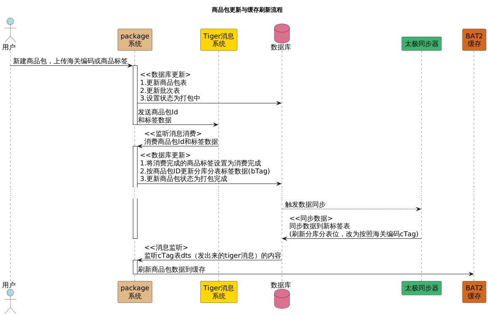
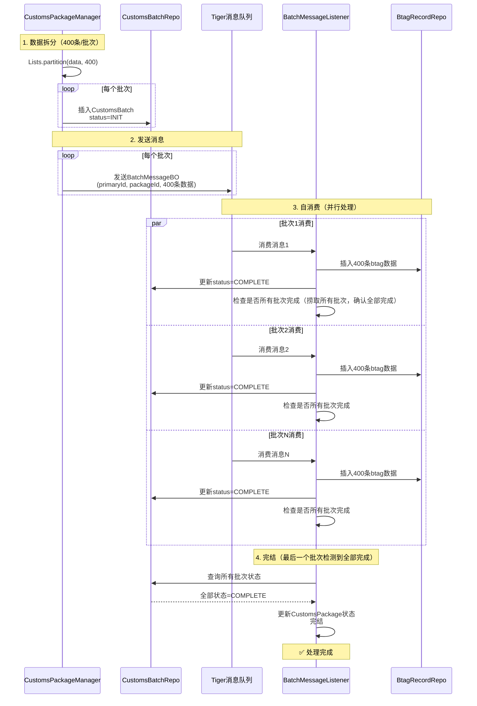
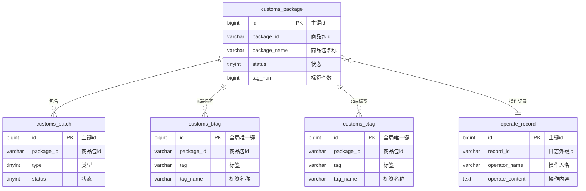

# 商品包

## WHAT：什么是商品包

背景：

这个项目的背景解释起来可能比较复杂，我讲的时候您有什么疑问可以随时打断我：一个包裹从国内到海外，有多条可以选择的线路，系统会匹配一条最优的线路来实际承担这次运输，但是这条线路可能不能清包裹中的部分商品，那这个包裹到海外了也得被退回来。

Temu的每个包裹在出海过目的国海关的时候，系统（渠道预判）一般都会匹配出多条可选线路（比如选不同的物流商，口岸，运输方式），但是某些线路可能包含一些不可清商品，怎么确定某条线路是否包含不可清商品呢。我们实现了一个商品包的规则系统，创建一个商品包，打包一部分商品（可能是海关编码，或者商品标签），把这个商品包绑定到某条线路上，就表示这条线路不可清商品包内的这些商品。（可能比较抽象）

我举个例子，我们可以创建一个名为：菜鸟国际-美国-洛杉矶口岸不可清商品包，里面打包的商品有汽车配件相关的海关编码，然后把这个商品包绑定到对应的清关线路上，当某个包裹中的部分商品被这个规则命中，就说明这条线路是不通的。

## WHY为什么一定要用商品包

如果没有这套规则：

> 商品到海关 → 包裹退回 → 二次分配 → 成本和时效大幅损失
>
> 会增加逆向的成本，而且会影响包裹时效

早期低配规则：

其实我们早期在商品基础侧做过一个拦截的能力，但是有两个较大问题

1. 拦截能力太宽，只能按国家维度去配置，比如菜鸟在洛杉矶口岸不能清汽车配件，他就只能在美国拦截所有物流服务商清汽车配件的能力，误杀范围太大
2. 只能按商品商品描述去匹配关键词，而不是细化到具体商品，比如配置商品描述中包含汽车的所有商品，可能会误杀玩具汽车

总结就是太死板，误杀太多，商品包支持细化到具体物流商，口岸；商品的命中是精确到海关编码维度或者商品标签维度。

## RESULT做的结果如何（数据）

数据大汇总

**QPS**：日均5亿级调用，QPS日均水位在6k ，流量比较平滑，峰值打到1wQPS，没有大波峰波谷（日常缩容到34台，大促50台机器）

**Redis QPS**：rpc：60k；命令：500k；后台校验任务会占用一部分QPS（每小时1次校验，每次约15分钟）

**数据库QPS**：分库比较低：50，单库有300左右

**请求批次**：skuSet:50;

**限流**：集群限流1w多，水位达80%告警，控制单机QPS 300左右，系统的负载会低一些

**请求rt**：主要分布在50-100ms；平均时延80ms；95线 150ms；999线 250ms，尖刺4s，有时候是下游做切库导致接口少量超时告警+报错

**数据库延迟**：mysql：redis：平均0.5ms，最大40ms，not found 90%

**机器**：日常34台，大促50台，4C8G；

**机器负载**：保持2左右，平均到单核0.5，CPU使用率保持30%左右，线程数400，WAITING/TIMED_WAITING : RUNNABLE = 2:1 BLOCK极少

**数据规模**：近一亿；数据库：2C8G100G

**分库分表**：8库8表（8主16备8灾）

**分库分表算法**：crc32算法对路由key进行hash的到数值H，让后H对库数取模得到库号，H对库数取余，在对表数取模；高位选库，低位选表，尽量把数据打在不同的分表上

**为什么分表**：单表数据也不能太多，不然走索引IO次数增加

**CPU**：40%以下，内存80%以下，否则告警，扩容，大促必扩容

JVM心跳：

GC：每分钟10-15次，每次2-3ms；

JVM参数：Xmx6G Xss512K MaxMetaspaceSize = 512M

一般会有什么异常：下游少量超时，QPS达到阈值，业务异常，比如某个sku的海关编码查不到

分库分表键怎么选：

ID的生成：

## 架构是这么设计的

1. 录入层，国家线负责人录入规则

   （存储：规则记录存单库单表，然后通过异步的方式分批次存规则明细）

2. 异步消息层，由于数据量较大，录入完成后返回状态录入中，异步完成规则明细的处理：分批次发送规则id和海关编码的明细消息，收到消息后分批次插入分库分表

3. 数据同步系统：这块是基础组件的能力，主要是倒排索引的思维

4. DTS+缓存系统：接受DTS消息，统一更新缓存

5. RPC接入层：由于流量大，牺牲强一致性，设计多级缓存

## 难点

难点汇总

> 1. 存储：规则细导致数据量巨大，而且数据随业务扩张和政策变化会不断扩张，而且数据长期活跃，不能归档，怎么存储是个问题
> 2. 性能：Temu所有包裹在出仓库前都要来查，而且是把包裹下的所有的商品打散来批量查，并发量大（亿级别）
> 3. 服务基础链路，需要高保障，不能降级

## 流程图（实现）

## 一致性怎么保证

最终一致性，无强一致性要求

每小时做一次扫全表校验数据库和缓存的一致性（每30分钟一次，每次15分钟）

观测目标：同一个商品标签，缓存查到命中的商品包和数据库是一致的（这里有个补偿机制，如果不一致，更新缓存，可能是延迟导致，有告警）

实现：

> 对于每一个商品包，先分库A查所有的规则明细，然后以200个标签一批次去校验（先按分库分表分批次）
>
> 所有标签反查分库B拿到命中的商品包id列表
>
> 查数据库看命中的商品包id列表
>
> 看两个列表是否一致

怎么解决校验时的更新

> 低概率事件，我们设置的是一分钟出现不一致的次数>1才灾难告警
>
> 补偿机制也会立即修复

## 做了什么保障

| 风险类型 | 风险项               | 影响                                                         | 处理手段                                                     | 历史经验                                                     |
| -------- | -------------------- | ------------------------------------------------------------ | ------------------------------------------------------------ | ------------------------------------------------------------ |
| 系统维度 | 系统负载高，系统雪崩 | 渠道预判查询失败，仓库无法分单                               | 发现手段： A. RT告警（200ms灾难，120ms严重） B. 失败率告警（2分钟失败>3灾难，>1严重） C. 机器CPU告警（5分钟50灾难，40严重） D. 数据库CPU告警 E. 数据库无慢sql  防控手段： A. 权限隔离 B. 限流 C. 弹性扩缩容（大促增加机器数） | 事故报告：标签服务发生过雪崩， 雪崩前数据库水位已经较高， 伴随上游流量增加，最终雪崩 还是要保持冗余：CPU，内存，JVM |
| 系统维度 | 接口RT耗时增加       | 仓内作业耗时增加 可能原因： A.下游接口RT耗时 B.数据量极大导致耗时增加  | 提供的接口平均RT超200ms告警 外部接口超75ms告警          |                                                              |
| 系统维度 | 新迭代可能引入问题   |                                                              | 发布严格灰度发布，先发1% 接入流量回放（代办）           |                                                              |
| 系统维度 | 上游重复调用         | 接口QPS虚高                                                  | 理论上可以通过包裹号+traceId来定位是否重复调用，推上游调整逻辑（代办） |                                                              |
| 数据维度 | 内部缓存不一致       | 分单准确性                                                   | 定时任务缓存校验                                             |                                                              |
| 业务维度 | 管理员操作异常       |                                                              | 操作加审批流 下线前校验是否被绑定                       |                                                              |

## 别人做了什么

最近发现sku->hscode的映射会变化，最近在做这个消息：查看是否影响商品包现状，变化的同步消息给渠道预判

## 上下游

上游

商品标签系统：（维护sku -> 商品标签的关系）

海关编码系统：（维护sku -> 海关编码的关系）

流量来源渠道预判

