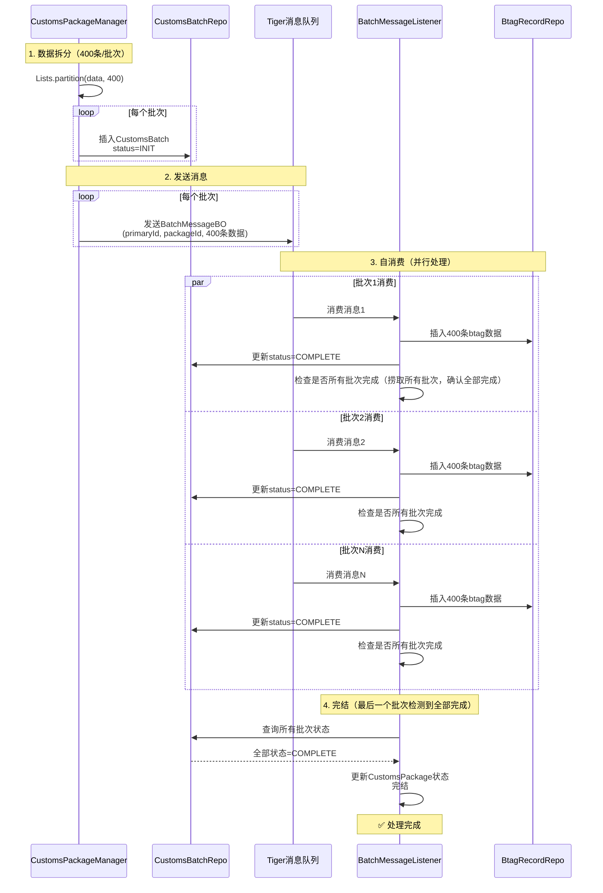
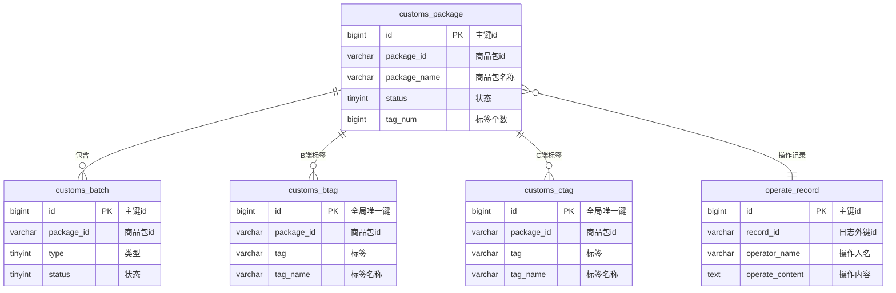

# 商品包

## WHAT：什么是商品包

背景：

这个项目的背景解释起来可能比较复杂，我讲的时候您有什么疑问可以随时打断我：一个包裹从国内到海外，有多条可以选择的线路，系统会匹配一条最优的线路来实际承担这次运输，但是这条线路可能不能清包裹中的部分商品，那这个包裹到海外了也得被退回来。

Temu的每个包裹在出海过目的国海关的时候，系统（渠道预判）一般都会匹配出多条可选线路（比如选不同的物流商，口岸，运输方式），但是某些线路可能包含一些不可清商品，怎么确定某条线路是否包含不可清商品呢。我们实现了一个商品包的规则系统，创建一个商品包，打包一部分商品（可能是海关编码，或者商品标签），把这个商品包绑定到某条线路上，就表示这条线路不可清商品包内的这些商品。（可能比较抽象）

我举个例子，我们可以创建一个名为：菜鸟国际-美国-洛杉矶口岸不可清商品包，里面打包的商品有汽车配件相关的海关编码，然后把这个商品包绑定到对应的清关线路上，当某个包裹中的部分商品被这个规则命中，就说明这条线路是不通的。

## WHY为什么一定要用商品包

如果没有这套规则：

> 商品到海关 → 包裹退回 → 二次分配 → 成本和时效大幅损失
>
> 会增加逆向的成本，而且会影响包裹时效

早期低配规则：

其实我们早期在商品基础侧做过一个拦截的能力，但是有两个较大问题

1. 拦截能力太宽，只能按国家维度去配置，比如菜鸟在洛杉矶口岸不能清汽车配件，他就只能在美国拦截所有物流服务商清汽车配件的能力，误杀范围太大
2. 只能按商品商品描述去匹配关键词，而不是细化到具体商品，比如配置商品描述中包含汽车的所有商品，可能会误杀玩具汽车

总结就是太死板，误杀太多，商品包支持细化到具体物流商，口岸；商品的命中是精确到海关编码维度或者商品标签维度。

## RESULT做的结果如何

数据大汇总

QPS：日均亿级调用，日均6k的QPS ，峰值打到几万QPS（最多时候50台机器，单机1kQPS）

机器：50台，4C8G；数据规模：近一亿；数据库：2C8G100G

分库分表：8库8表（8主16备8灾）

分库分表算法：crc32算法对路由key进行hash的到数值H，让后H对库数取模得到库号，H对库数取余，在对表数取模；高位选库，低位选表，尽量把数据打在不同的分表上

为什么分表：单表数据也不能太多，不然走索引IO次数增加

CPU：40%以下，内存60%以下，否则告警

## HOW怎么实现的

难点汇总

> 1. 存储：规则细导致数据量巨大，而且数据随业务扩张和政策变化会不断扩张，而且数据长期活跃，不能归档，怎么存储是个问题
> 2. 性能：Temu所有包裹在出仓库前都要来查，而且是把包裹下的所有的商品打散来批量查，并发量大（亿级别）
> 3. 服务基础链路，需要高保障，不能降级

流量、架构、瓶颈、治理。

一致性问题

限流与保护

系统监控

事故复盘

